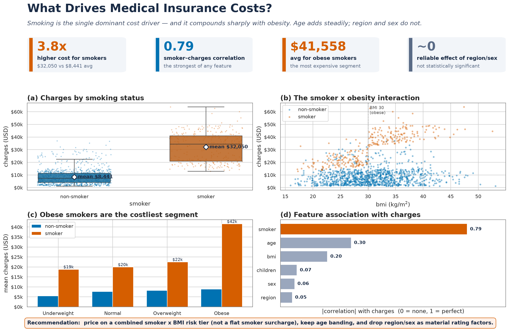
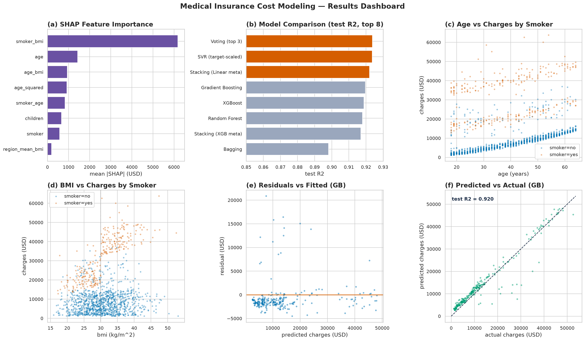
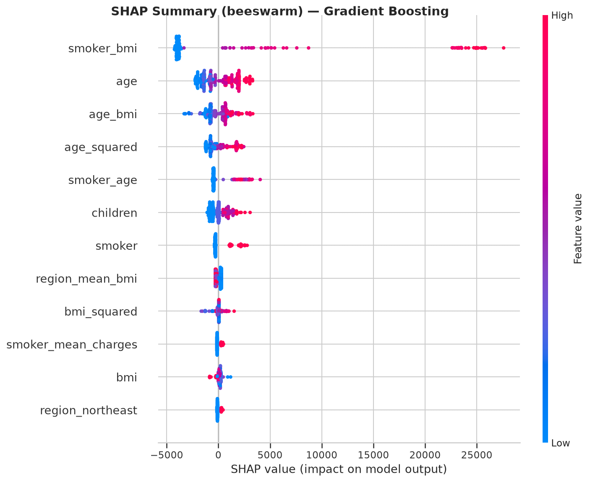
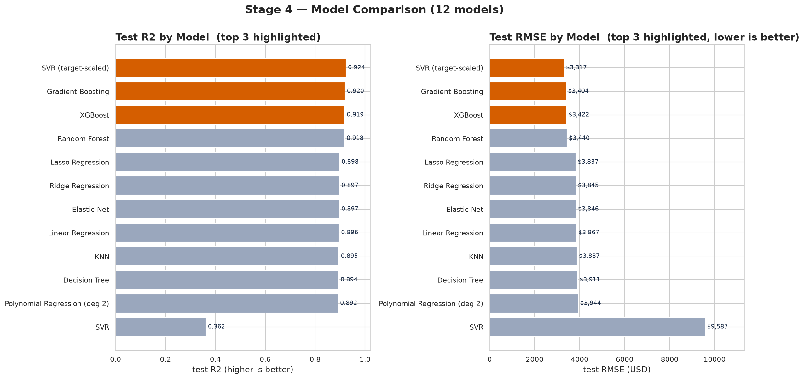
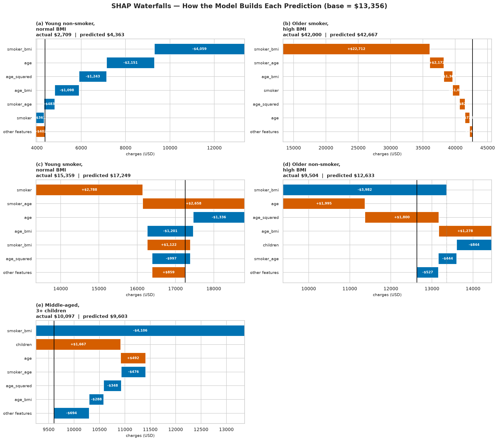

# Medical Insurance Cost Prediction — End-to-End Data Science Project

[](https://subhransudhar-projects.github.io/medical-insurance-cost-prediction/)
[](https://subhransudhar-projects.github.io/medical-insurance-cost-prediction/#model)
[](#model-performance)
[](#key-visualizations)
[](https://subhransudhar-projects.github.io/medical-insurance-cost-prediction/#shap)
[](#)

Predicting individual annual medical insurance charges from demographic and health
data, and turning the findings into an actionable, explainable pricing strategy.

> **📊 [View the full visual report →](https://subhransudhar-projects.github.io/medical-insurance-cost-prediction/)** — a
> chaptered, 25-figure case study (data → findings → model → SHAP → business impact) with click-to-enlarge charts.

> **Headline:** A production **Gradient Boosting** model predicts annual charges with a
> cross-validated **R² ≈ 0.85** (RMSE ≈ $3,400). The analysis shows **smoking — especially
> combined with obesity — is by far the dominant cost driver**, while region and sex are not
> reliable drivers. A conservative action plan is worth **~$15M/year per 10,000 members**.

---

## Business problem

Health insurers must predict what a customer will cost in order to price policies fairly,
identify high-risk members, target wellness programs, and manage financial risk. Mispricing
cuts both ways — too high loses customers to competitors, too low loses money on claims. This
project answers three questions from a portfolio of policyholders:

1. **What drives medical cost?**
2. **Can we predict an individual's annual charges accurately and transparently?**
3. **What should the business do differently as a result?**

*(The "insurance company" framing throughout the reports is an illustrative business scenario
used to structure the analysis, not a real named client.)*

## Dataset

| Column | Type | Description |
|---|---|---|
| `age` | numeric | Age of the primary beneficiary (18–64) |
| `sex` | categorical | male / female |
| `bmi` | numeric | Body Mass Index (kg/m²) |
| `children` | numeric | Number of dependents covered |
| `smoker` | categorical | yes / no |
| `region` | categorical | northeast / northwest / southeast / southwest |
| `charges` | numeric | **Target** — annual medical charges billed (USD) |

**1,337 records** after cleaning (one exact duplicate removed; 0 missing values). Class balance:
~20.5% smokers, ~50/50 sex, ~even across regions.

## Methodology

A four-stage pipeline, each stage self-contained in its own folder:

1. **Cleaning & validation** — schema/type checks, missing/duplicate handling, range validation.
2. **Exploratory data analysis** — univariate, bivariate, multivariate + hypothesis testing
   (t-tests, Welch ANOVA, correlation significance).
3. **Visualization** — 58 publication-quality static figures + 7 interactive charts across 7 categories.
4. **Predictive modeling** — feature engineering, leakage-controlled stratified split, **17 model
   configurations** (12 algorithms + 5 ensembles) tuned with `GridSearchCV`, honestly cross-validated,
   then explained with **SHAP**.

**Rigor highlights:** target-encoded features refit **train-only** to prevent leakage; scale-sensitive
models wrapped in per-fold pipelines; the +0.076 optimism of the test split over CV was **measured and
reported** rather than hidden.

## Key findings (with numbers)

| Segment | Mean annual charges |
|---|---|
| Non-smoker (any BMI) | ~$8,400 |
| Smoker, non-obese | $21,363 |
| **Smoker, obese (BMI≥30)** | **$41,558** |
| Non-smoker, obese | $8,856 |

- **Smoking dominates:** smokers average **$32,050 vs $8,441** (a $23,610 gap); smokers are **20.5% of
  members but 49.5% of all claims cost**.
- **Smoking × obesity compounds:** obese smokers pay **$20,195 more than non-obese smokers**; obesity
  barely matters for non-smokers. The risk multiplies, it doesn't add.
- **Age** adds ~$267/year (~$2,700/decade) — steady but secondary.
- **Region and sex are not reliable drivers** (region failed variance-robust ANOVA; sex effect negligible).
- **SHAP:** smoking-related features account for **62%** of the model's predictive weight; `age` ~11%;
  region + sex combined **3.6%**.

## Model performance

Honest cross-validated metrics (5-fold on the training set); test = held-out 20% split.

| Model | Test R² | CV R² | Test RMSE | Test MAE |
|---|---|---|---|---|
| SVR (target-scaled) | 0.924 | 0.847 | $3,317 | $1,756 |
| Voting (top 3) | 0.924 | 0.848 | $3,316 | $1,931 |
| Stacking (Linear meta) | 0.922 | — | $3,352 | $2,112 |
| **Gradient Boosting** ⭐ | 0.920 | 0.840 | $3,404 | $2,108 |
| XGBoost | 0.919 | 0.844 | $3,422 | $2,106 |
| Random Forest | 0.918 | 0.840 | $3,440 | $2,150 |
| Linear / Ridge / Lasso / ENet | ~0.897 | ~0.825 | ~$3,840 | ~$2,530 |

⭐ **Selected for production: Gradient Boosting.** The top ~6 models are a statistical tie (CV-mean spread
0.008 vs CV std 0.040), so we chose the model that is accurate, simple, and natively explainable rather
than a marginally-higher ensemble. **Honest headline: CV R² ≈ 0.85**, typically predicting within
~$1,800–2,600 of a customer's actual annual cost.

## How to run

```bash
# From the project folder, using the bundled virtual environment
.venv/Scripts/python.exe clean_and_validate.py          # Stage 1: cleaning
.venv/Scripts/python.exe eda_analysis.py                # Stage 2: EDA
.venv/Scripts/python.exe visualizations/cat1_distributions.py   # Stage 3: viz (cat1..cat7)
.venv/Scripts/python.exe modeling/chunk1_load.py        # Stage 4: modeling (chunk1..chunk35)
```
All runs are seeded (`random_state=42`) and reproducible. Dependencies are pinned in `requirements.txt`.
Reusable functions are refactored into `src/` (`data_preprocessing`, `feature_engineering`,
`model_training`, `model_evaluation`).

## Technologies used

`Python 3.12` · `pandas` · `numpy` · `scikit-learn 1.9` · `XGBoost 3.3` · `SHAP 0.52` ·
`matplotlib` · `seaborn` · `plotly` (+ `kaleido`) · `scipy` · `statsmodels` · `joblib`

## Key visualizations

**Stage-3 executive dashboard — what drives cost**


**Stage-4 modeling results dashboard**


**SHAP global feature importance (why the model predicts what it does)**


**Model comparison (17 configurations)**


**Individual prediction explanations (SHAP waterfalls)**


## Project structure

```
Medical Insurance Cost Dataset/
├── README.md                     # this file
├── insurance.csv / insurance_cleaned.csv
├── clean_and_validate.py         # Stage 1
├── eda_analysis.py               # Stage 2  (+ data_quality_report.md, eda_report.md)
├── visualizations/               # Stage 3  (58 figures, 7 interactive, report)
├── modeling/                     # Stage 4  (chunk1..chunk35, results/, figures/, models/)
├── reports/                      # business_report.md, technical_report.md
└── src/                          # refactored reusable modules
```

## Other projects
- **GitHub:** https://github.com/subhransudhar-projects
- **Portfolio:** https://subhransudhar-projects.github.io/

## Contact
**Subhransu Dhar**
- Portfolio: https://subhransudhar-projects.github.io/
- GitHub: https://github.com/subhransudhar-projects
- Email: subhransu.dhar@gmail.com

---
*This project emphasizes methodological honesty: every metric is cross-validated, leakage is controlled,
and limitations are stated explicitly. Numbers in this README are the actual verified results from the
code in this repository.*
