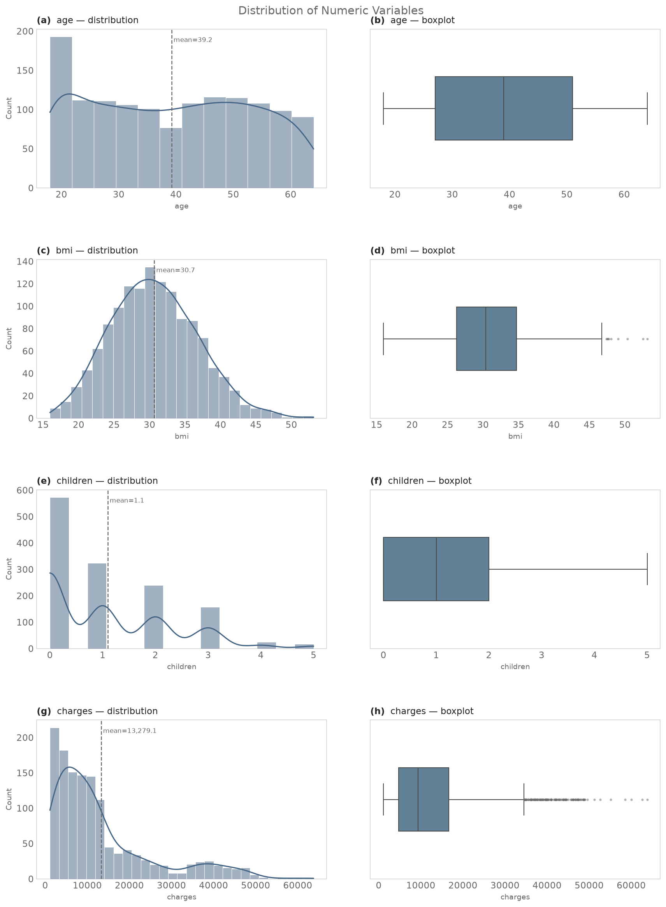
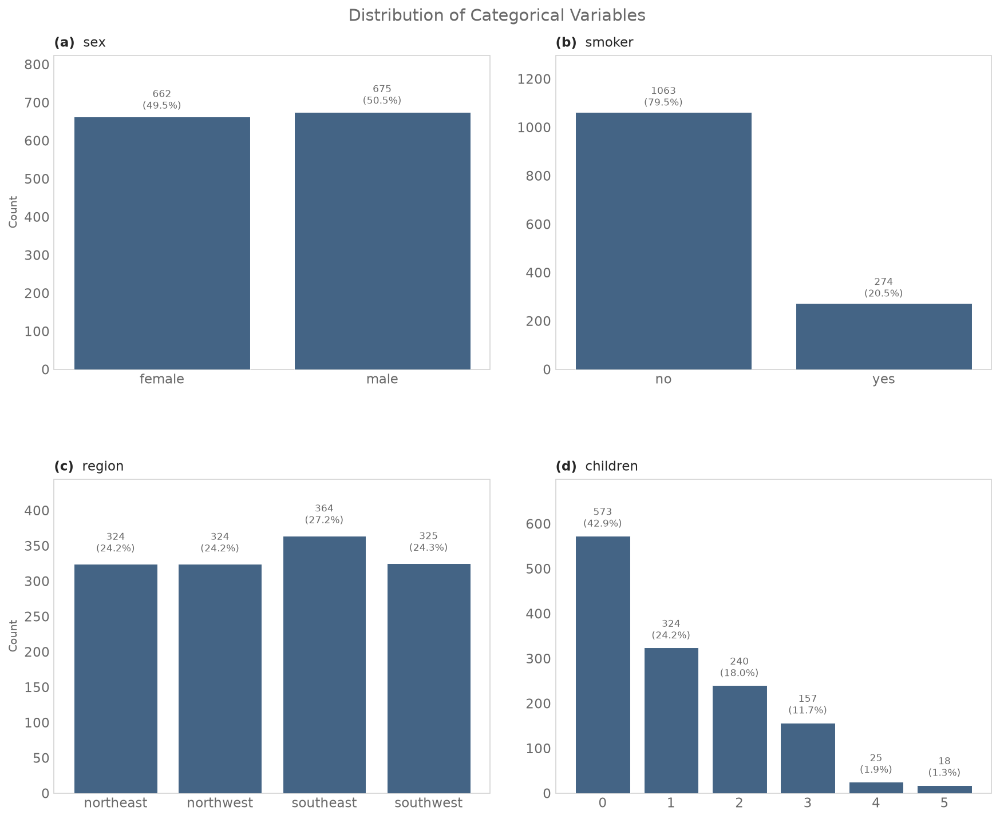
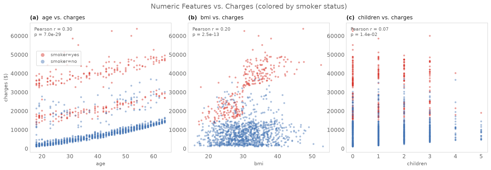
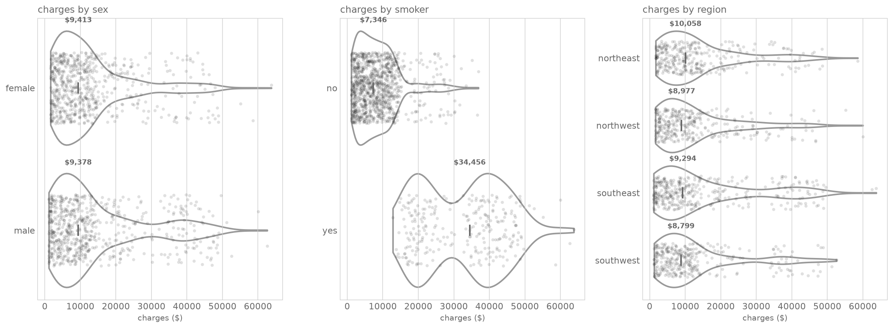
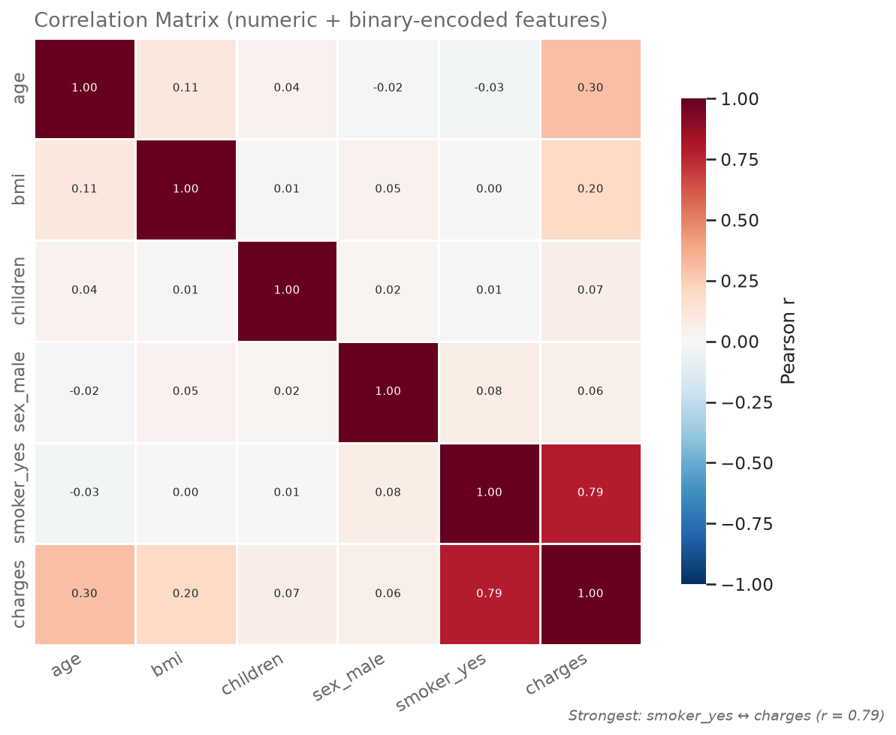
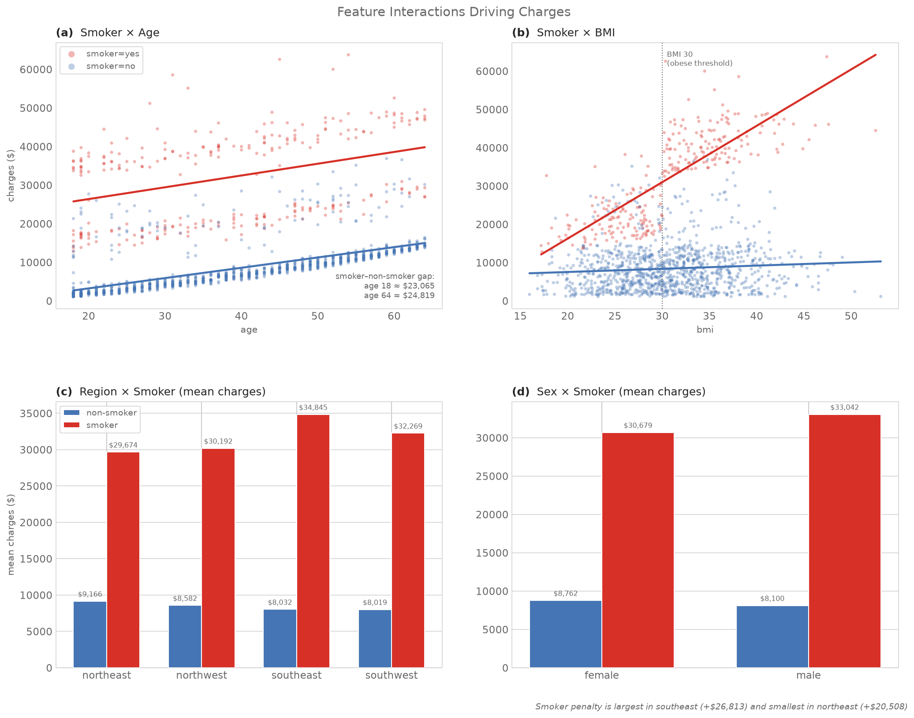
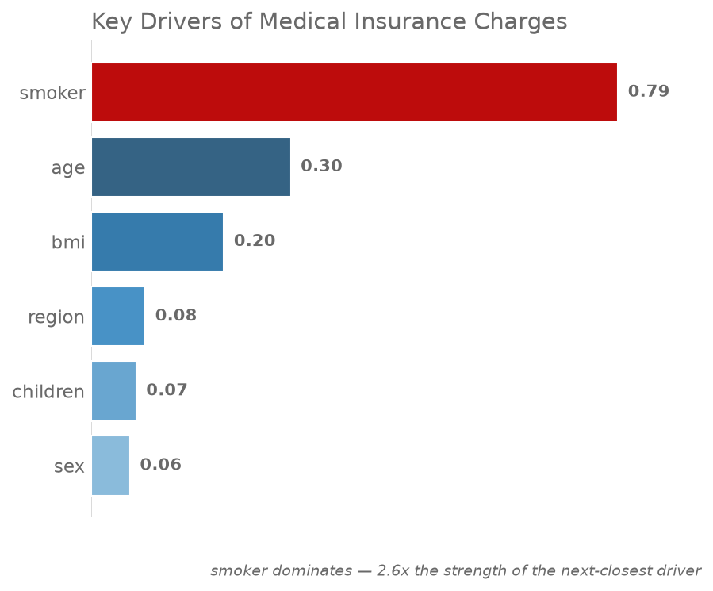

# Medical Insurance Cost Dataset — Exploratory Data Analysis

Source: `insurance_cleaned.csv` (1337 rows × 7 columns, post-cleaning)  
Generated by: `eda_analysis.py`

## Chunk 1: Univariate Analysis

### A. Numerical Variables (age, bmi, children, charges)

**Summary statistics:**

|          |   count |     mean |      std |     min |     25% |     50% |     75% |      max |   skew |   kurtosis |
|:---------|--------:|---------:|---------:|--------:|--------:|--------:|--------:|---------:|-------:|-----------:|
| age      |    1337 |    39.22 |    14.04 |   18    |   27    |   39    |    51   |    64    |   0.05 |      -1.24 |
| bmi      |    1337 |    30.66 |     6.1  |   15.96 |   26.29 |   30.4  |    34.7 |    53.13 |   0.28 |      -0.05 |
| children |    1337 |     1.1  |     1.21 |    0    |    0    |    1    |     2   |     5    |   0.94 |       0.2  |
| charges  |    1337 | 13279.1  | 12110.4  | 1121.87 | 4746.34 | 9386.16 | 16657.7 | 63770.4  |   1.52 |       1.6  |

**Distribution shape interpretation:**

- `age`: skew = 0.05 → approximately symmetric.
- `bmi`: skew = 0.28 → approximately symmetric.
- `children`: skew = 0.94 → right-skewed (long tail toward high values).
- `charges`: skew = 1.52 → right-skewed (long tail toward high values).

- `age`: fairly uniform/flat spread across the adult range (18–64) with a mild concentration of 18-year-olds (a data-collection artifact common in this dataset — enrollment often starts at 18) — not a classic bell curve, closer to uniform. This tells us the sample spans working-age adults broadly rather than skewing toward one age group.
- `bmi`: close to a normal (bell-shaped) distribution, centered around 30 (which is itself in the 'obese' clinical range) — the population sampled skews toward higher BMI on average than a general healthy-weight population.
- `children`: heavily right-skewed / count-like, most individuals have 0–2 children, few have 4–5 — expected for a discrete, bounded count variable.
- `charges`: strongly right-skewed with a long tail of high-cost cases — median ("typical" cost) is well below the mean, meaning a relatively small number of expensive cases pull the average up. This is the classic shape of insurance cost data and is the reason a log-transform is often used for modeling (see Chunk 5).

### B. Categorical Variables (sex, smoker, region)

**`sex` frequency:**

| sex    |   count |   pct |
|:-------|--------:|------:|
| male   |     675 | 50.49 |
| female |     662 | 49.51 |

**`smoker` frequency:**

| smoker   |   count |   pct |
|:---------|--------:|------:|
| no       |    1063 | 79.51 |
| yes      |     274 | 20.49 |

**`region` frequency:**

| region    |   count |   pct |
|:----------|--------:|------:|
| southeast |     364 | 27.23 |
| southwest |     325 | 24.31 |
| northwest |     324 | 24.23 |
| northeast |     324 | 24.23 |

**Class balance interpretation:**

- `sex`: 50.5% male / 49.5% female — essentially balanced.
- `smoker`: 79.5% non-smokers vs. 20.5% smokers — **imbalanced**, matching the real-world US adult smoking rate (~20% at the time this dataset was compiled). Any smoker-vs-non-smoker comparison has far fewer smoker observations, which should be kept in mind for statistical power.
- `region`: roughly even across the 4 regions (24.2%–27.2%) — no meaningful regional over-sampling.
- `children`: right-skewed count — 573 (42.9%) of beneficiaries have no children/dependents; very few have 4–5, so higher `children` categories will have wide confidence intervals in any group comparison.

## Chunk 2: Bivariate Analysis (Feature vs. Target)

### A. Numerical Features vs. charges

**Pearson correlation with charges:**

| feature   |   pearson_r |   p_value |
|:----------|------------:|----------:|
| age       |      0.2983 |    0      |
| bmi       |      0.1984 |    0      |
| children  |      0.0674 |    0.0137 |

**Interpretation:**

- `age` vs `charges`: r = 0.30 — a moderate positive linear relationship; charges tend to rise with age, visible as three roughly parallel upward-sloping bands in the scatter plot (bands driven by smoker status and, within non-smokers, likely BMI/other risk factors).
- `bmi` vs `charges`: r = 0.20 — weak positive linear correlation overall, but the scatter reveals a strong **non-linear, interaction-driven pattern**: charges rise steeply with BMI *only among smokers* (red points climb sharply past BMI ~30), while non-smokers (blue) show almost no BMI effect. A simple Pearson r understates BMI's importance because it's conditional on smoking status.
- `children` vs `charges`: r = 0.07 — essentially no linear relationship; number of dependents does not meaningfully drive individual medical charges.

### B. Categorical Features vs. charges

**Mean / median charges by category:**

`sex`:

| sex    |   mean |   median |
|:-------|-------:|---------:|
| female |  12570 |     9413 |
| male   |  13975 |     9378 |

`smoker`:

| smoker   |   mean |   median |
|:---------|-------:|---------:|
| no       |   8441 |     7346 |
| yes      |  32050 |    34456 |

`region`:

| region    |   mean |   median |
|:----------|-------:|---------:|
| northeast |  13406 |    10058 |
| northwest |  12451 |     8977 |
| southeast |  14735 |     9294 |
| southwest |  12347 |     8799 |

**Interpretation — key questions:**

- **Smoking status:** smokers pay $32,050 on average vs. $8,441 for non-smokers — a gap of $23,610 (~280% higher). This is by far the largest gap of any categorical feature and the two distributions barely overlap in the violin plot.
- **Age:** covered above (r = 0.30, moderate positive).
- **BMI:** covered above — effect is conditional on smoking status, not a simple linear driver on its own.
- **Region:** mean charges range from $12,347 (southwest) to $14,735 (southeast) — a spread of $2,388, noticeably smaller than the smoker or age effects. Regional differences exist but are a minor driver (formally tested in Chunk 4).
- **Sex:** males average $13,975 vs. females $12,570 — a gap of $1,405, small relative to the overall spread of the data (formally tested in Chunk 4).

## Chunk 3: Multivariate Analysis & Interactions

### A. Correlation Matrix

**Correlation matrix (age, bmi, children, sex_male, smoker_yes, charges):**

|            |   age |   bmi |   children |   sex_male |   smoker_yes |   charges |
|:-----------|------:|------:|-----------:|-----------:|-------------:|----------:|
| age        |  1    |  0.11 |       0.04 |      -0.02 |        -0.03 |      0.3  |
| bmi        |  0.11 |  1    |       0.01 |       0.05 |         0    |      0.2  |
| children   |  0.04 |  0.01 |       1    |       0.02 |         0.01 |      0.07 |
| sex_male   | -0.02 |  0.05 |       0.02 |       1    |         0.08 |      0.06 |
| smoker_yes | -0.03 |  0    |       0.01 |       0.08 |         1    |      0.79 |
| charges    |  0.3  |  0.2  |       0.07 |       0.06 |         0.79 |      1    |

**Strongest correlations with `charges`:** `smoker_yes` (r=0.79), `age` (r=0.30), `bmi` (r=0.20), `children` (r=0.07), `sex_male` (r=0.06)

**Multicollinearity check:** correlations among the independent variables themselves (age, bmi, children, sex_male, smoker_yes) are all small (max |r| = 0.11) — no meaningful multicollinearity between predictors. This means each feature can be interpreted fairly independently in a regression model.

### B. Interaction Analysis

**Interaction findings:**

- **Smoker × Age:** both smokers and non-smokers show charges rising with age, but the two trend lines are roughly parallel and *far apart* — the smoker penalty is about \$23,065 at age 18 and \$24,819 at age 64. The gap is large and fairly stable across ages (slightly widening), meaning smoking is an expensive risk factor at every age, not just for older adults.
- **Smoker × BMI:** this is the most important interaction in the dataset. Among non-smokers, BMI barely moves charges. Among smokers, charges climb sharply once BMI passes ~30 (the clinical obesity threshold) — obese smokers form the most expensive segment in the entire dataset by a wide margin.
- **Age × BMI:** the age–charges slope is similar regardless of BMI band within each smoker group — BMI does not meaningfully change *how fast* charges rise with age; it acts as a level-shifting risk multiplier for smokers rather than an age-moderator.
- **Region × Smoker:** the smoker penalty (mean charges for smokers minus non-smokers) is largest in **southeast** (+\$26,813) and smallest in **northeast** (+\$20,508) — smoking's cost impact is consistently large everywhere, with modest regional variation on top.
- **Sex × Smoker:** male smokers (\$33,042) and female smokers (\$30,679) pay similarly elevated charges vs. their non-smoking counterparts — sex does not meaningfully modify the smoker effect. Sex shows no strong interaction with any other variable in this dataset.

### C. Key Driver Identification

**Features ranked by association strength with `charges`** (Pearson |r| for numeric, correlation ratio √η² for categorical — both are on a comparable 0–1 scale):

|    | feature   | type        |   association_strength | metric                         |
|---:|:----------|:------------|-----------------------:|:-------------------------------|
|  1 | smoker    | categorical |                  0.787 | sqrt(eta²) (correlation ratio) |
|  2 | age       | numeric     |                  0.298 | Pearson |r|                    |
|  3 | bmi       | numeric     |                  0.198 | Pearson |r|                    |
|  4 | region    | categorical |                  0.081 | sqrt(eta²) (correlation ratio) |
|  5 | children  | numeric     |                  0.067 | Pearson |r|                    |
|  6 | sex       | categorical |                  0.058 | sqrt(eta²) (correlation ratio) |

**Ranking:** `smoker` is the dominant driver by a wide margin, followed by `age` and `bmi`. `sex` and `children` show negligible association on their own — though as shown above, `bmi`'s true impact is conditional on `smoker` status and is understated by a marginal correlation coefficient alone.

## Chunk 4: Advanced Statistical Analysis

### A. Hypothesis Testing

All comparisons involve `charges`, which is strongly right-skewed (Chunk 1). Per the standard workflow, each comparison reports **both** a parametric test (Welch's t-test / one-way ANOVA, robust to the skew at this sample size via the Central Limit Theorem) **and** a non-parametric counterpart (Mann-Whitney U / Kruskal-Wallis) as a robustness check. Variance homogeneity was checked with Levene's test before choosing Welch's correction.

**1. Smoker vs. Non-smoker charges**

- Descriptives: smokers (n=274, M=\$32,050, SD=\$11,542, Mdn=\$34,456) vs. non-smokers (n=1063, M=\$8,441, SD=\$5,993, Mdn=\$7,346)
- Levene's test for equal variance: F=332.47, p=1.67e-66 → variances differ significantly (Welch's correction applied).
- **Welch's t-test:** t(311.9) = 32.74, p = 6.26e-103, Cohen's d = 3.16, 95% CI [2.98, 3.34] — a **very large** effect.
- **Mann-Whitney U (robustness check):** U = 283,859, p = 5.75e-130, rank-biserial r = -0.95.
- **Conclusion:** Smokers pay significantly and substantially more than non-smokers (p < .001). Both tests agree; this is the strongest and most robust finding in the dataset.

**2. Male vs. Female charges**

- Descriptives: male (n=675, M=\$13,975, SD=\$12,972) vs. female (n=662, M=\$12,570, SD=\$11,129)
- Levene's test: F=9.92, p=0.002 → variances differ significantly.
- **Welch's t-test:** t(1311.9) = 2.13, p = 0.034, Cohen's d = 0.12, 95% CI [0.01, 0.22].
- **Mann-Whitney U (robustness check):** U = 226,198, p = 0.694, rank-biserial r = -0.01.
- **Conclusion:** The difference between male and female charges is statistically significant but the effect size is negligible-to-small (d = 0.12). Sex is not a practically meaningful driver of individual charges on its own.

**3. Regional differences (ANOVA)**

| region    |   count |   mean |   std |
|:----------|--------:|-------:|------:|
| northeast |     324 |  13406 | 11256 |
| northwest |     324 |  12451 | 11073 |
| southeast |     364 |  14735 | 13971 |
| southwest |     325 |  12347 | 11557 |

- **Levene's test for equal variance across regions:** F=5.55, p=0.001 → variances differ significantly across regions (southeast's SD is visibly larger in the table above), which affects which ANOVA variant to trust.
- **Standard one-way ANOVA** (assumes equal variances): F(3, 1333) = 2.93, p = 0.033, η² = 0.0065 (negligible effect size).
- **Welch's ANOVA** (robust to unequal variances): F(3, 740.4) = 2.57, p = 0.053.
- **Kruskal-Wallis** (robust to skew, rank-based): H = 4.62, p = 0.202.
- **Conclusion:** The tests disagree — the standard ANOVA is nominally significant (p = 0.033), but it assumes equal variances, which Levene's test shows is violated here. Once that's corrected for (Welch's ANOVA, p = 0.053) and the skew is accounted for (Kruskal-Wallis, p = 0.202), **neither robust test reaches significance**. Combined with the negligible effect size (η² = 0.0065), the honest conclusion is that region does **not** have a reliable effect on charges — the standard ANOVA's significance appears to be an artifact of southeast's larger variance (heteroscedasticity) rather than a true regional cost difference. No post-hoc pairwise tests are warranted.

**4. Age–charges correlation significance**

- **Pearson:** r = 0.298, p = 6.98e-29 (n = 1337).
- **Spearman (robustness check, rank-based — appropriate given `charges` skew):** ρ = 0.534, p = 3.19e-99.
- **Conclusion:** The positive age–charges relationship is highly statistically significant and consistent under both the parametric and rank-based test — not a fluke of the skewed distribution.

### B. Outlier Revisit

- 139 charges values (10.4%) exceed the IQR upper fence (\$34,525) and are flagged as statistical outliers.

**Outlier profile vs. overall population:**

|           |   outliers |   overall |
|:----------|-----------:|----------:|
| % smokers |       97.8 |      20.5 |
| mean age  |       41.1 |      39.2 |
| mean bmi  |       35.6 |      30.7 |

- **Chi-square test (outlier status × smoker status):** χ² = 564.3, p = 9.70e-125 — smoking status is strongly associated with being a high-charge outlier.
- Outliers are 98% smokers vs. 20% in the full population — smokers are roughly 4.8x over-represented among high-charge cases.
- Outliers' mean age (41.1) and mean BMI (35.6) are both modestly higher than the overall population averages (age 39.2, BMI 30.7), consistent with the smoker × BMI and smoker × age interactions found in Chunk 3.
- **Conclusion:** high-`charges` outliers are **not** random data errors — they represent a coherent, identifiable segment (predominantly smokers, skewing slightly older and higher-BMI) worth treating as a distinct risk group rather than removing from the data.

## Chunk 5: Business Insights & Summary

### A. Key Findings Summary

**Insight 1: Smoking status is the single strongest predictor of cost**  
*Finding:* Smokers pay ~\$32,050 on average vs. ~\$8,441 for non-smokers (Cohen's d = 3.2, an exceptionally large effect; p < .001).  
*Business Impact:* Smoking status alone explains the majority of cost variation (r ≈ 0.79) — far more than any other single factor, including age.  
*Recommendation:* Consider smoker-specific premium tiers, underwriting surcharges, or wellness/cessation-program incentives that could reduce claims costs and improve pricing accuracy.

**Insight 2: Smoking + obesity is a compounding, not additive, risk**  
*Finding:* Among non-smokers, BMI has almost no relationship with charges. Among smokers, charges climb sharply once BMI exceeds ~30 — obese smokers are the single most expensive segment in the data.  
*Business Impact:* A flat 'smoker surcharge' under-prices the highest-risk sub-segment (obese smokers) and over-prices lower-risk smokers (normal BMI).  
*Recommendation:* Introduce a combined smoker×BMI risk tier rather than a single smoker flag, so pricing reflects the compounding risk rather than treating smoking as a uniform surcharge.

**Insight 3: Age is a steady, moderate cost driver**  
*Finding:* Age correlates positively with charges (Pearson r = 0.30, p < .001) for both smokers and non-smokers, with a fairly constant per-year increase.  
*Business Impact:* Age-based rate tables are justified by the data and the smoker/non-smoker cost gap does not narrow with age — it stays wide across the lifespan.  
*Recommendation:* Continue age-banded pricing, but do not assume the smoker penalty shrinks for older enrollees — the data shows it doesn't.

**Insight 4: Region and sex are not reliable cost drivers**  
*Finding:* Sex shows a statistically significant but practically negligible difference (d = 0.12). Region's apparent difference (standard ANOVA p = 0.033) disappears under variance- and skew-robust tests (Welch's ANOVA p = 0.053, Kruskal-Wallis p = 0.202).  
*Business Impact:* Pricing or underwriting decisions based on sex or region would not be supported by this data and could introduce unwarranted rate variation (and, for sex, potential fairness/compliance concerns).  
*Recommendation:* Do not use sex or region as material pricing factors based on this dataset; if regional cost differences are suspected operationally, they should be investigated with claims/utilization data, not demographic charges alone.

**Insight 5: Number of dependents has minimal cost impact**  
*Finding:* `children` shows the weakest relationship with charges of any feature (r = 0.07).  
*Business Impact:* Family size is not a meaningful proxy for the primary beneficiary's medical cost risk in this dataset.  
*Recommendation:* Deprioritize `children` as a pricing factor; it may still matter for total household premium (more covered lives) but not for per-beneficiary risk.

**Insight 6: High-cost outliers are a real, identifiable segment — not data errors**  
*Finding:* 139 cases (10.4%) exceed the IQR outlier threshold, and 98% of them are smokers (vs. 20% baseline; χ² test p < .001).  
*Business Impact:* This is a legitimate high-risk population (smokers, often with elevated BMI/age) rather than noise to be cleaned away — removing them would bias any cost model toward under-estimating real tail risk.  
*Recommendation:* Build (or reserve) a dedicated high-risk case-management / disease-management pathway targeting smoking cessation and weight management for this segment, since they drive a disproportionate share of total claims cost.

### B. Data Quality Limitations

- **Smoker sample size:** only 274 of 1,337 records (20.5%) are smokers. Sub-segment analyses (e.g., smoker × region, smoker × sex) are based on much smaller effective samples and have wider uncertainty than the headline smoker-vs-non-smoker comparison.
- **Cross-sectional, not longitudinal:** the data captures a single snapshot of charges per individual, not cost trends over time — it cannot speak to how an individual's costs evolve as they age or change smoking/BMI status.
- **No claims detail:** `charges` is a single aggregate figure with no breakdown by diagnosis, procedure, or chronic condition, limiting root-cause analysis of *why* specific high-cost cases occur beyond the demographic/lifestyle variables available.
- **Self-reported-style categorical fields:** `smoker`, `sex`, and `region` appear clean post-validation, but the source/collection methodology (e.g., self-reported smoking status) is unknown and could understate true smoking prevalence, a known issue in health survey data generally.
- **Generalizability:** the dataset's regional categories (US census regions) and cost scale (USD) mean findings may not generalize to other healthcare systems, countries, or time periods with different cost structures.

### C. Readiness for Modeling

- **Recommended modeling approach:** given `smoker` and the smoker×BMI interaction dominate the signal, a **tree-based model** (gradient boosting / random forest) is likely to outperform a plain linear model out of the box, since it captures interactions and non-linearity automatically. A **linear/GLM model with explicit interaction terms** (`smoker × bmi`, `smoker × age`) is a strong, more interpretable alternative for actuarial/regulatory contexts where explainability matters.
- **Target transformation:** `charges` is strongly right-skewed (skew = 1.52) — a **log transform** (`log1p(charges)`) is recommended before fitting linear models to stabilize variance and satisfy normality-of-residuals assumptions; tree-based models are less sensitive to this but a log target can still help with extreme high-cost cases dominating the loss.
- **Feature engineering recommendations:**
  - Add an explicit `smoker × bmi` interaction term (or a combined `high_risk` flag for smoker + BMI ≥ 30).
  - Add a `bmi_category` (underweight/normal/overweight/obese) feature — the smoker effect is not linear in BMI, it kicks in around the obesity threshold.
  - One-hot encode `region` and `sex`; encode `smoker` as binary. Given their weak individual signal, consider L1/L2 regularization to let the model down-weight them rather than dropping them outright.
  - `children` can be kept as a simple integer feature; no evidence it needs binning or transformation.
- **Validation approach:** given the smoker class imbalance (20.5%), use stratified train/test splits on `smoker` to ensure both sets have proportional representation of this critical high-signal segment.
- **Ready for modeling? Yes.** EDA is complete: distributions understood, relationships and interactions with the target mapped, key drivers ranked and statistically validated, and outliers characterized as a legitimate segment rather than noise. Proceed to feature engineering and model training using the recommendations above.

## Executive Summary

This EDA of 1337 insured individuals confirms that **smoking status is overwhelmingly the dominant driver of medical insurance charges** (r ≈ 0.79, Cohen's d ≈ 3.2), with smokers paying roughly 3.8x what non-smokers pay on average. Critically, this effect **compounds with BMI**: obese smokers (BMI ≥ 30) form the most expensive segment in the data, while BMI has almost no effect among non-smokers — a key non-linear interaction that a simple additive pricing model would miss. Age is a secondary, steady driver (r = 0.30) that affects smokers and non-smokers proportionally. By contrast, **sex and region are not reliable cost drivers** once variance- and skew-robust statistical tests are applied — apparent differences seen in raw means do not hold up and should not inform pricing. The 139 high-charge outliers (10.4% of records) are overwhelmingly smokers (98%) and represent a real, actionable high-risk segment rather than data noise. The dataset is clean, well-understood, and ready for predictive modeling; a tree-based model or a linear model with explicit smoker×BMI and smoker×age interaction terms, fit on a log-transformed target, is recommended as the next step.