# Medical Insurance Cost Dataset — Visualization Suite

**Stage 3 of 3** · Data Cleaning ✔  ·  Exploratory Data Analysis ✔  ·  **Visualization (this document)**

## Introduction

This document is a comprehensive, publication-ready visualization suite that tells the
complete story of **what drives medical insurance `charges`**. It uses the exact dataset
schema throughout — `age`, `sex`, `bmi`, `children`, `smoker`, `region`, `charges` — and
never renames a column.

**Approach.** Every chart is generated from a single shared configuration module
(`viz_config.py`) so the entire suite is visually coherent:

- **One colorblind-safe palette** (Wong 2011) used everywhere, with *fixed semantic colors*
  — `smoker` is always vermillion (yes) / blue (no), so a reader learns the encoding once.
  No red-green combinations appear anywhere.
- **Consistent derived categories:** `age_group` (18-30, 31-40, 41-50, 51-64) and
  `bmi_category` (Underweight <18.5, Normal 18.5-24.9, Overweight 25-29.9, Obese ≥30).
- **Publication styling:** seaborn whitegrid, titles ≥14pt, axis labels ≥12pt with units
  (`charges (USD)`, `bmi (kg/m²)`, `age (years)`), value labels on bars, alpha on dense
  scatter, and an annotated insight on the charts that carry the headline findings.
- **Libraries:** matplotlib, seaborn, and plotly (interactive charts exported to both `.html`
  and a static `.png`), supported by pandas, numpy, scipy.stats, statsmodels, and squarify.

**How to read this suite.** Categories 1–6 build the evidence from the ground up
(distributions → relationships → group comparisons → multivariate structure → advanced/3D →
creative). Category 7 curates the most decisive views into a one-page executive dashboard and
walks through the narrative. All image files live in `figures/`; interactive versions are
linked inline where they exist.

**The one-sentence takeaway:** *`smoker` is overwhelmingly the dominant driver of `charges`,
it compounds sharply with high `bmi`, `age` adds a steady secondary effect, and `region`,
`sex`, and `children` are not reliable drivers.*

---

## Category 1: Distribution Visualizations (Univariate)

This category profiles each variable on its own — the four numerics (age, bmi, children, charges) and the three categoricals (sex, smoker, region) — to establish the shape, spread, and skew of every field before any relationship is examined. Throughout, `charges` is the modelling target and `smoker` is flagged as its dominant driver.

### cat1_hist_kde — Histogram with KDE overlay

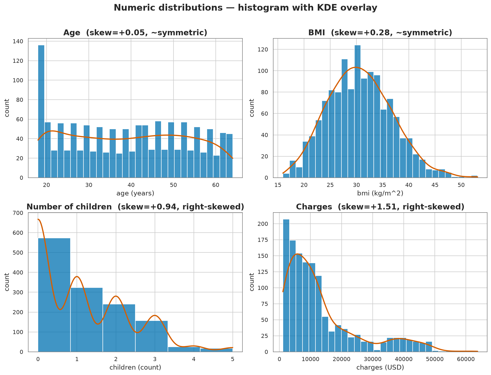

**Interpretation:** `charges` is strongly right-skewed (skew +1.51) with a long high-cost tail, `bmi` is near-normal centred around 30, `age` is roughly uniform across 18-64 with a pronounced spike at 18, and `children` is right-skewed with most policyholders having zero. The heavy charges tail is the first sign that a log transform will help downstream modelling.

**Styling choice:** The KDE line is drawn in the vermillion accent over blue bars so the smoothed density stands out against the histogram without introducing a red-green pairing; `children` uses one bin per integer value to avoid smoothing over its discrete nature.

### cat1_box_violin — Violin + box overlay

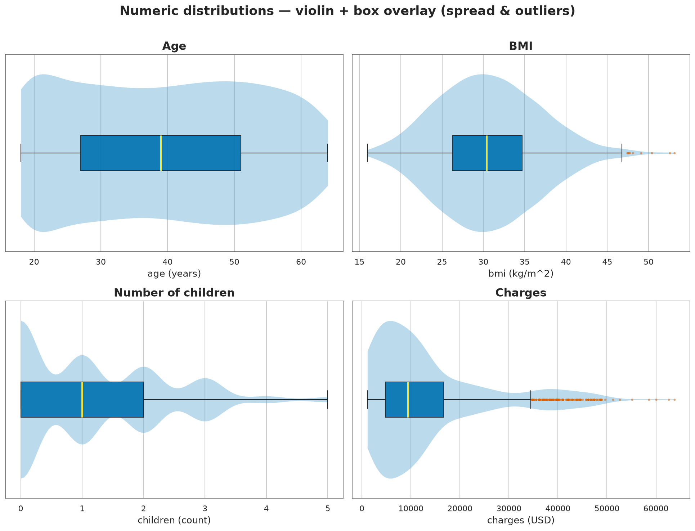

**Interpretation:** The boxes confirm the medians and IQRs while the violins expose shape detail the box hides — the multimodal "shoulders" of `children`, the tight symmetric core of `bmi`, and the dense low cluster of `charges` with many high-side outliers. Only `charges` and `bmi` carry a meaningful number of flagged outliers, and the charges outliers are the high-cost cases worth watching.

**Styling choice:** A translucent sky-blue violin sits behind a narrow solid box with a yellow median line, giving both the full density silhouette and the exact quartile summary in a single readable glyph.

### cat1_density — Smooth density (KDE)

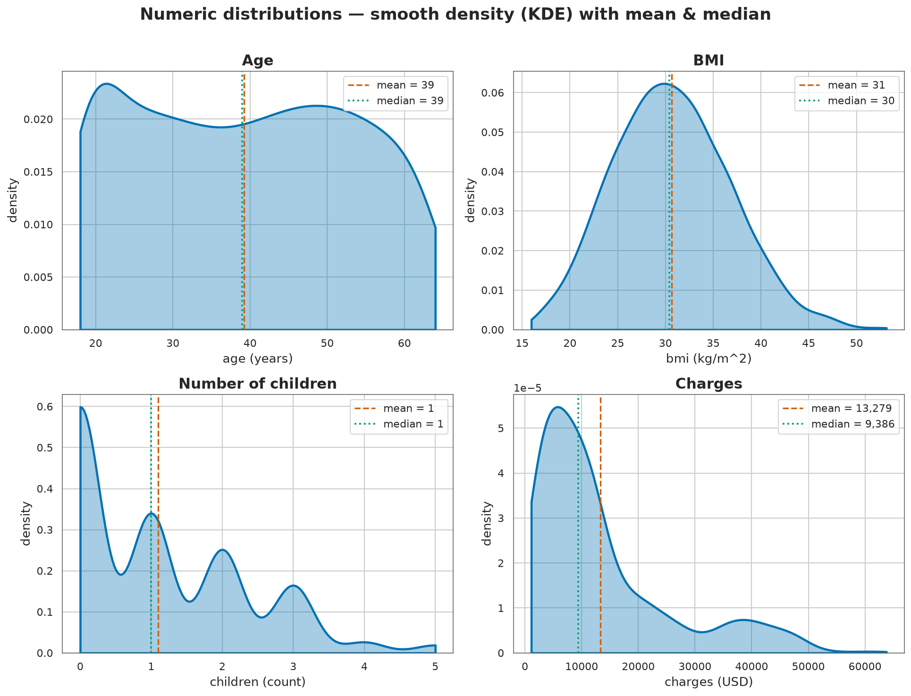

**Interpretation:** With the histogram bars removed, the mean-vs-median gap becomes the story: for `charges` the mean sits far right of the median, quantifying the right skew, whereas `bmi` shows the two nearly coincident (symmetry). This mean/median separation is the cleanest single-number cue for which variables violate normality.

**Styling choice:** Mean (dashed vermillion) and median (dotted green) reference lines are overlaid with numeric labels so the skew is read directly off the chart rather than inferred from the curve.

### cat1_qq — Q-Q plots vs normal

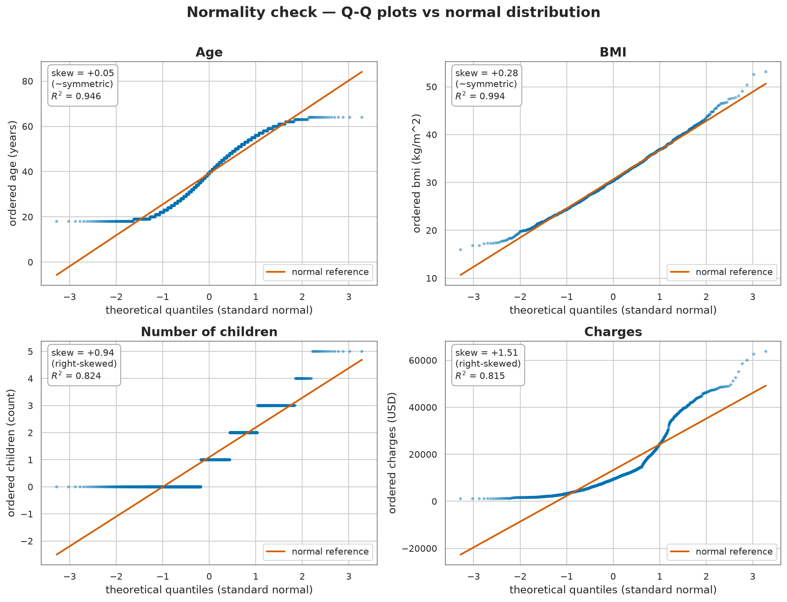

**Interpretation:** `bmi` hugs the normal reference line almost perfectly (R^2 = 0.994), confirming approximate normality, while `charges` bows well above the line at the upper quantiles (R^2 = 0.815, skew +1.51) — a textbook right-skew signature. `age` and `children` deviate at the extremes due to the 18-year spike and the discrete integer steps respectively.

**Styling choice:** Each panel carries an in-plot annotation box with the skew value, its verbal tag, and the fit R^2, so the normality verdict is explicit rather than left to visual judgement.

### cat1_ecdf — Empirical cumulative distribution (ECDF)

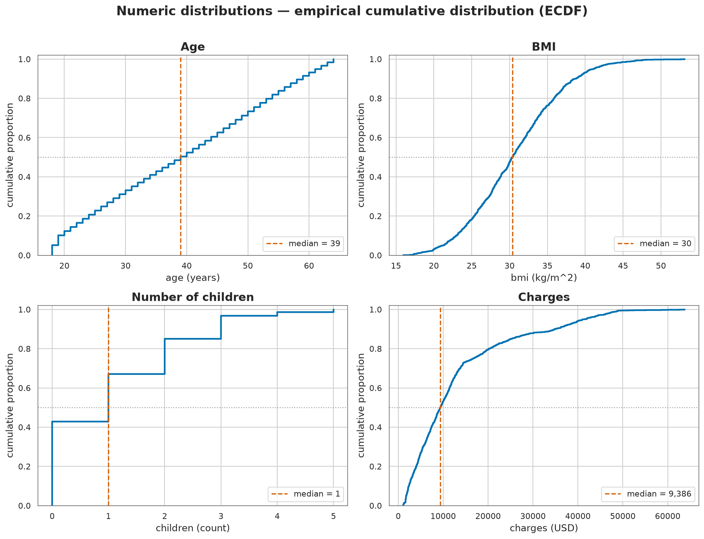

**Interpretation:** The ECDFs read off percentiles directly — the steep early rise of `charges` shows roughly 70% of policies fall under ~$15,000, with the curve flattening into a thin expensive tail. The near-diagonal `age` curve reiterates its uniformity, while `children` climbs in visible integer steps.

**Styling choice:** A median crosshair (horizontal 0.5 guide plus a labelled vertical line) anchors each panel, letting the reader locate the 50th percentile without tracing the curve by eye.

### cat1_bar_counts — Categorical counts

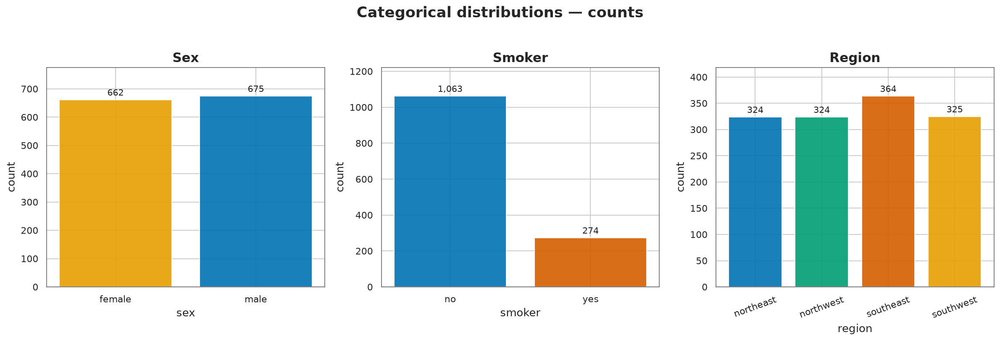

**Interpretation:** `sex` is essentially balanced, the four `region` groups are near-even, and `smoker` is the notable imbalance at roughly 80% non-smokers to 20% smokers. That skew in the strongest cost driver matters for later modelling, since the expensive smoker group is the minority class.

**Styling choice:** Value labels sit above every bar and each category uses its fixed semantic colour (e.g. smoker via the vermillion/blue palette) so colour meaning stays identical across the entire suite.

### cat1_pie — Percentage breakdown

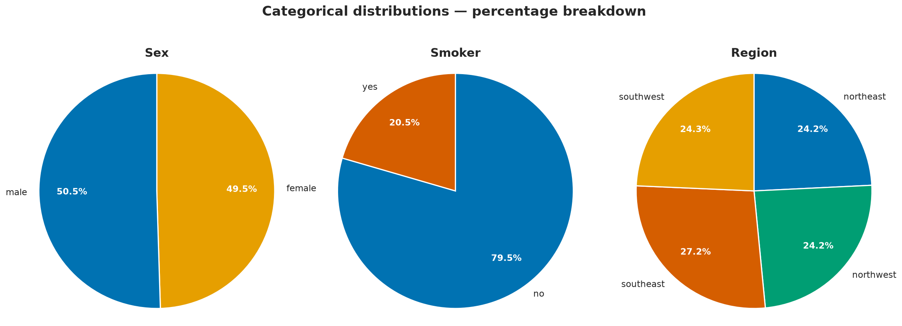

**Interpretation:** The percentage view reinforces the counts: sex splits ~49.5/50.5, region hovers near a 25% quarter each, and smoker sits at ~20.5% yes / 79.5% no. Pies are used only here, where the parts genuinely sum to a meaningful whole.

**Styling choice:** Percentages are printed inside each wedge in bold white and the semantic palette is reused, keeping the categorical colours consistent with the bar, waffle, and downstream charts.

### cat1_waffle — Waffle charts

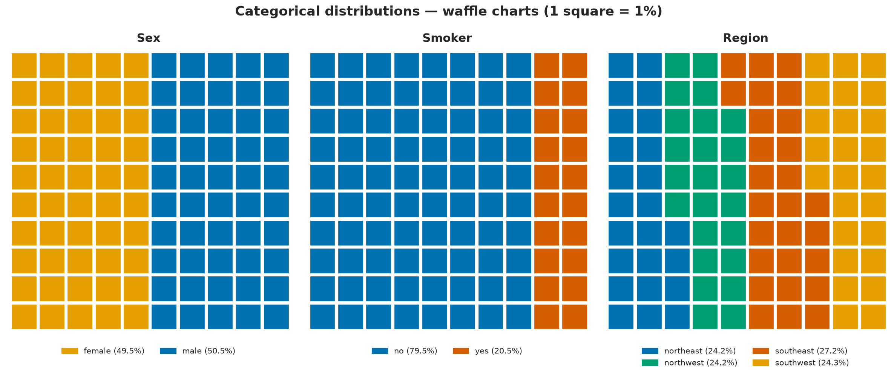

**Interpretation:** Each 10x10 grid frames one square as one percent, making the ~20 smoker squares vs ~80 non-smoker squares immediately tangible — a more intuitive read of the class imbalance than either the bar or pie. Sex reads as a near-even split and region as four comparable blocks.

**Styling choice:** Implemented manually (pywaffle unavailable) with largest-remainder rounding so the squares total exactly 100, and the legend prints the precise percentage next to each colour for accuracy alongside the visual impact.

### cat1_charges_binsensitivity — Charges histogram bin sensitivity

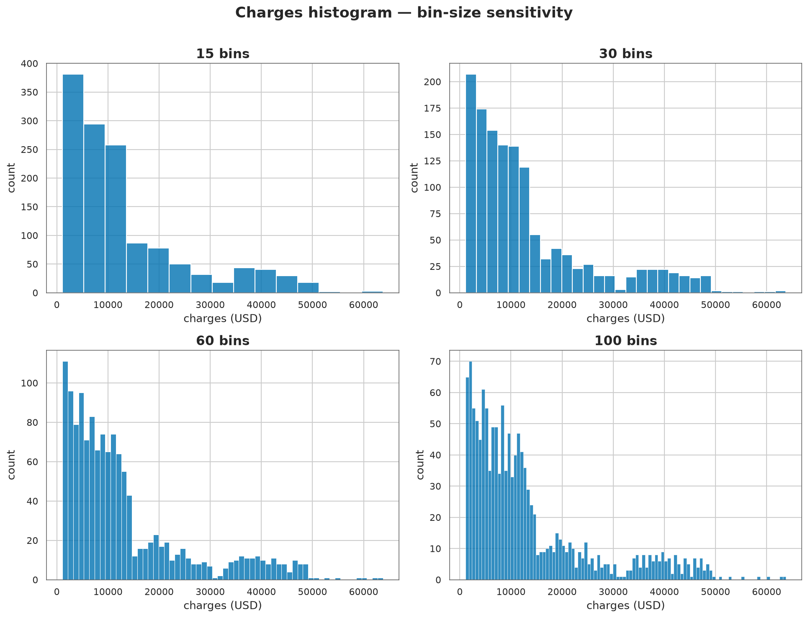

**Interpretation:** Across 15 to 100 bins the right-skewed shape and low-cost mode are stable, but finer binning progressively resolves a secondary bump around $40,000 — the high-cost (largely smoker) cluster that coarse bins blur away. This confirms the distribution's key features are real, not binning artefacts.

**Styling choice:** A 2x2 grid holds the bin resolution as the only variable, with identical colour and axis treatment across panels so the reader compares shape, not styling.

### cat1_charges_cdf — Charges cumulative distribution by smoker

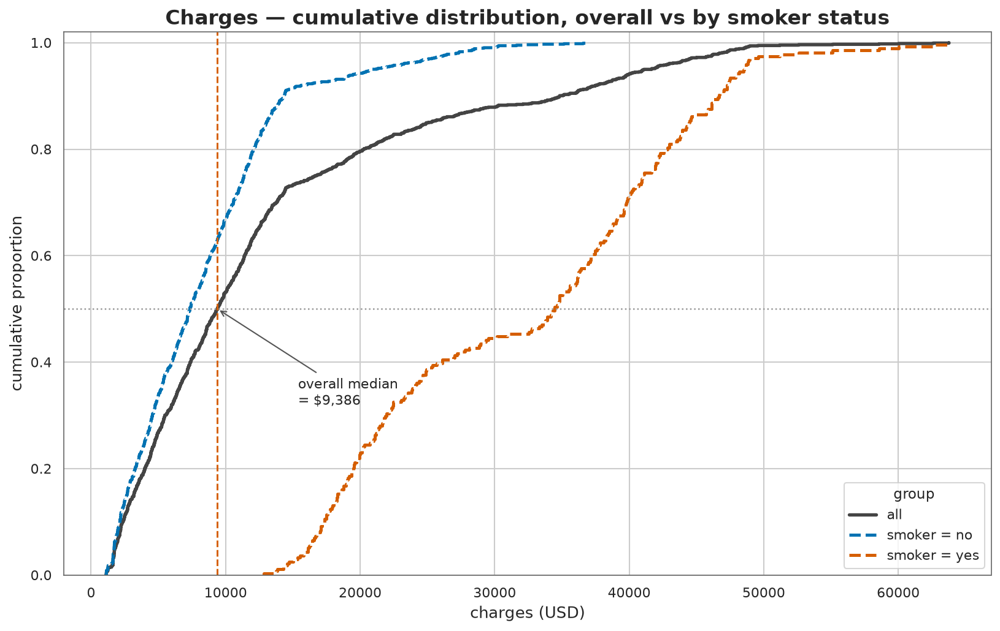

**Interpretation:** Splitting the CDF by smoker status separates the two curves dramatically — nearly all non-smokers fall below ~$15,000, whereas the smoker curve is shifted far to the right and barely begins until charges the non-smoker group has almost finished. This single panel is the clearest univariate evidence that `smoker` is the dominant cost driver.

**Styling choice:** The overall CDF is a neutral dark line with the two smoker groups dashed in their semantic colours, and an arrow annotates the overall median (~$9,386) so the split is anchored to a concrete reference value.

---

## Category 2: Relationship Visualizations (Bivariate — Feature vs. Target)

This category examines how each individual feature relates to the target, `charges (USD)`.
Numeric features (`age`, `bmi`, `children`) are explored with scatter, smoothing, density,
joint distributions and residual diagnostics; categorical features (`sex`, `smoker`, `region`)
with boxes, violins, point clouds, confidence-interval bars and faceting. Semantic colors are
fixed throughout: smokers are vermillion, non-smokers blue, all from the colorblind-safe Wong
palette (no red-green pairings).

### Linear fit with 95% confidence interval

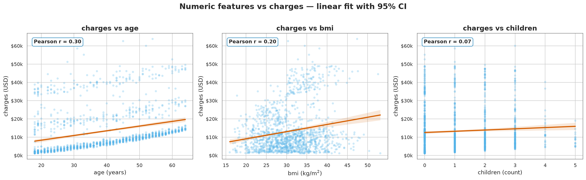

**Interpretation:** `age` shows the clearest positive linear slope (r ≈ 0.30), `bmi` a weaker
positive tilt (r ≈ 0.20), and `children` an essentially flat line (r ≈ 0.07); the wide vertical
scatter around every line signals that no single numeric feature explains charges on its own.
**Styling choice:** Points are drawn at low alpha with a light sky-blue so the vermillion
regression line and its shaded CI band stay legible over ~1,300 overlapping observations.

### Nonparametric LOWESS trend

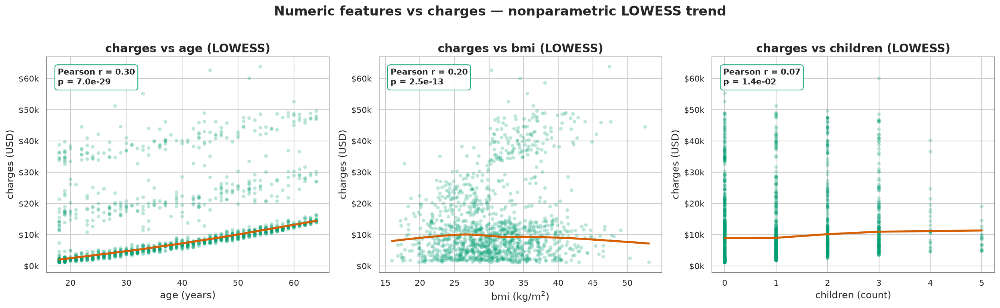

**Interpretation:** The LOWESS curves confirm the linear reads — `age` rises steadily while
`bmi` and `children` are nearly flat at the population level — and the two visible parallel bands
in the `age` panel foreshadow the smoker split explored later. **Styling choice:** Each panel is
annotated with its Pearson r and p-value in a boxed callout so the strength and significance of
the relationship are readable without a separate table.

### Hexbin density

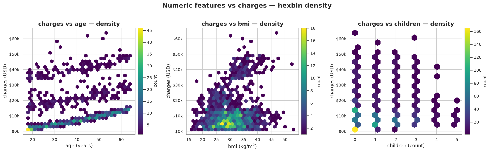

**Interpretation:** Binning reveals where the mass actually sits — a dense low-charge ridge
(< $15k) across all ages and bmis — which the raw scatter obscures through overplotting.
**Styling choice:** A perceptually-uniform, colorblind-safe viridis sequential colormap encodes
`count`, with an explicit colorbar so darker cells unambiguously mean more observations.

### Joint distribution — charges vs age

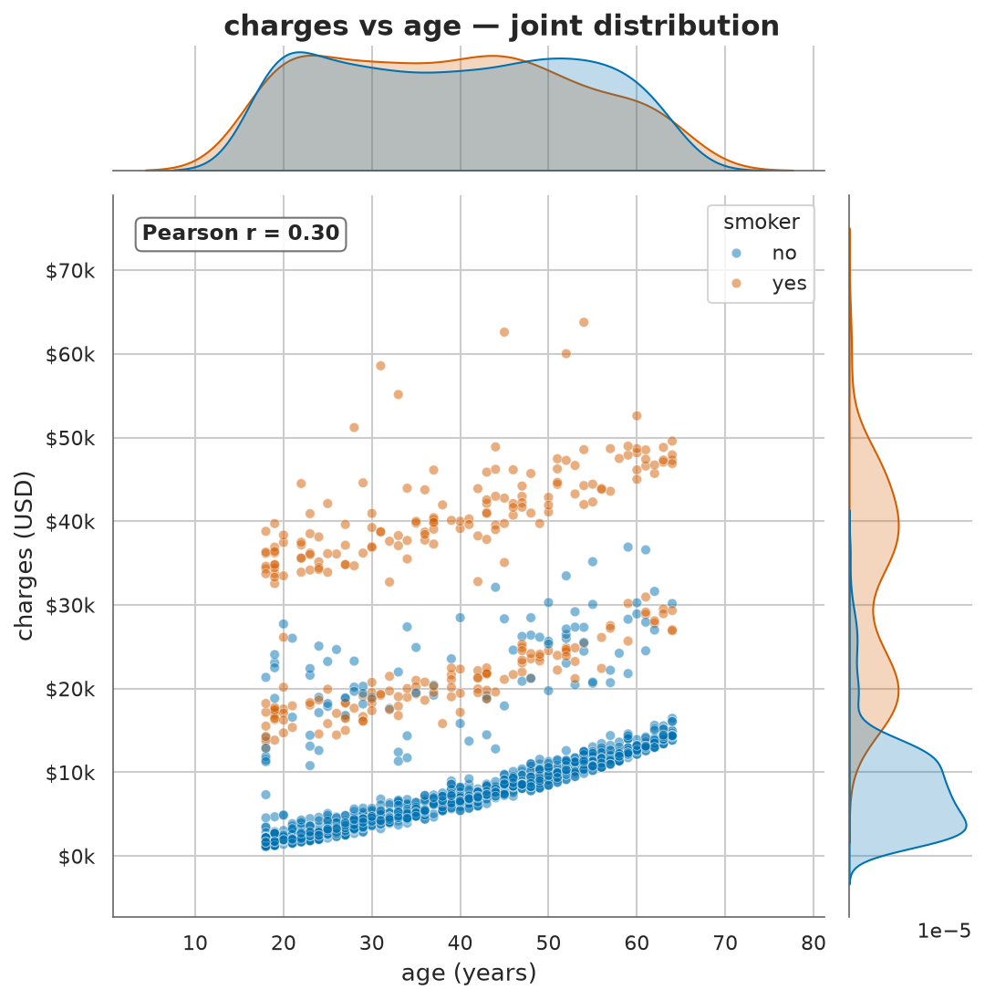

**Interpretation:** The joint scatter shows the same two rising bands, and the charges marginal
is strongly right-skewed with a long high-cost tail. **Styling choice:** Marginal histograms on
the top and right axes summarize each variable's univariate distribution alongside their joint
relationship in a single frame.

### Joint distribution — charges vs bmi (colored by smoker)

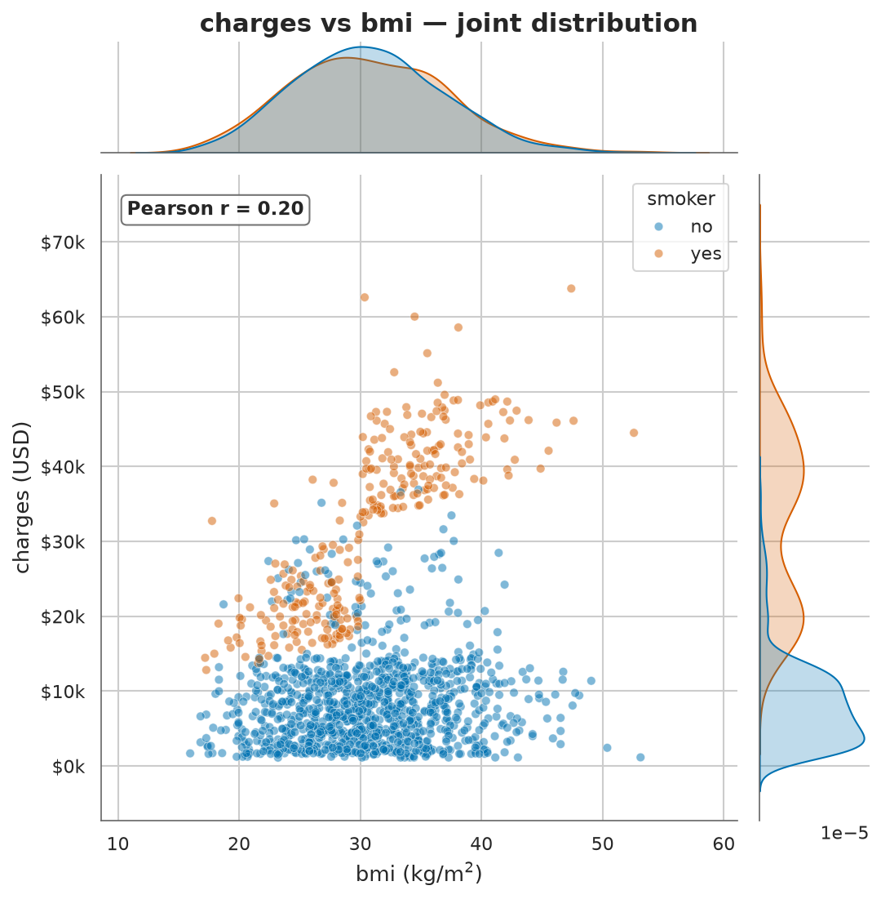

**Interpretation:** This is the most revealing panel: the bmi–charges effect is *conditional* —
the vermillion smoker cluster climbs sharply as bmi crosses ~30, while blue non-smokers stay
flat and low regardless of bmi, explaining why the overall r is only 0.20. **Styling choice:**
Coloring by `smoker` with the fixed semantic palette exposes an interaction that a single-color
scatter would completely hide.

### Joint distribution — charges vs children

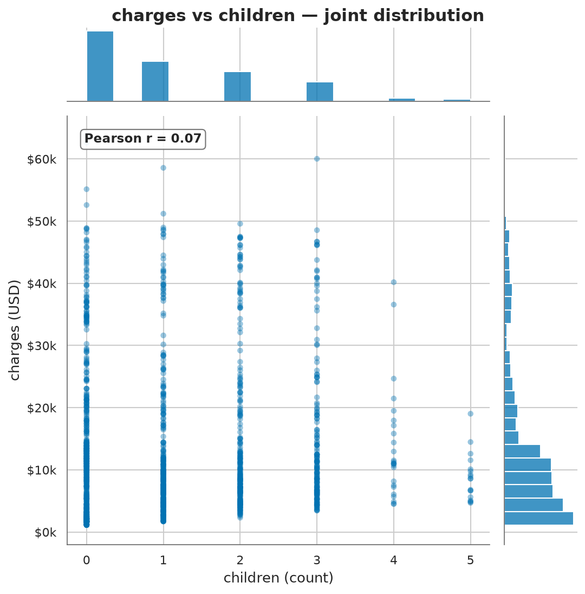

**Interpretation:** Charges are distributed almost identically across every family size, visually
confirming the negligible r ≈ 0.07 for `children`. **Styling choice:** The marginal on the x-axis
doubles as a count of records per child-number, showing most families have 0–2 children.

### OLS residual diagnostics

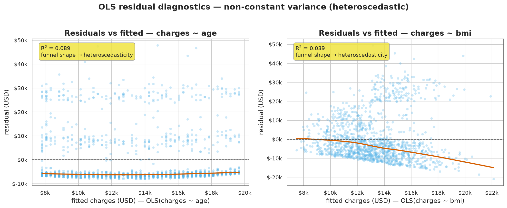

**Interpretation:** Both single-predictor models have very low R² (0.089 and 0.039) and their
residuals fan out and split into layers rather than scattering evenly around zero — clear
heteroscedasticity driven by the skewed target and the omitted smoker effect. **Styling choice:**
A dashed zero reference line plus a LOWESS residual trend and a highlighted R² callout make the
non-constant variance immediately visible.

### Charges by category — boxplots

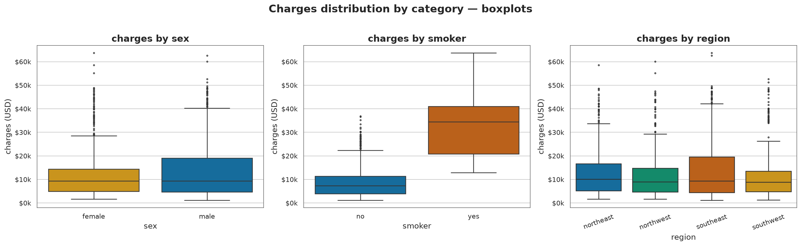

**Interpretation:** `smoker` produces a dramatic separation in medians and spread, whereas `sex`
and `region` boxes overlap heavily — early evidence that only smoking status is a reliable driver.
**Styling choice:** Consistent per-category semantic colors let the reader compare the three
panels at a glance while keeping smoker vermillion/blue coding intact.

### Charges by category — violin plots

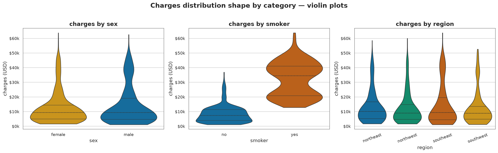

**Interpretation:** The violins expose distribution *shape*: non-smokers (and both sexes, all
regions) form a single low peak, while smokers are distinctly bimodal — a moderate cluster around
$20k and a high one near $40k. **Styling choice:** Inner quartile lines and `cut=0` give an honest
density that stops at the observed data range rather than extrapolating beyond it.

### Charges by category — individual observations

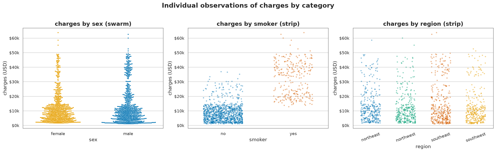

**Interpretation:** Plotting every point confirms the smoker bimodality is real (two dense point
clouds, not an artifact of smoothing) and that `sex`/`region` are thoroughly intermixed.
**Styling choice:** A non-overlapping swarm is used for the small-cardinality `sex` panel, while
jittered semi-transparent strips handle the denser `smoker` and `region` panels without a solid ink blob.

### Mean charges with 95% confidence intervals

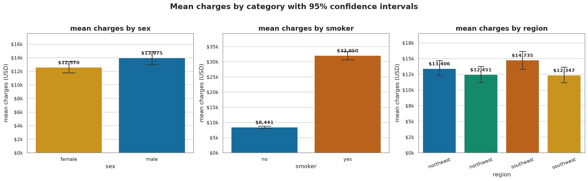

**Interpretation:** Only `smoker` shows non-overlapping confidence intervals (~$8.4k vs ~$32k);
the `sex` and `region` means differ by small amounts with overlapping CIs, i.e. they are not
statistically reliable drivers. **Styling choice:** Each bar is value-labeled with its exact mean
and capped 95% CI whiskers, so magnitude and uncertainty are both quantified on the figure.

### Faceted catplot — smoker effect across regions

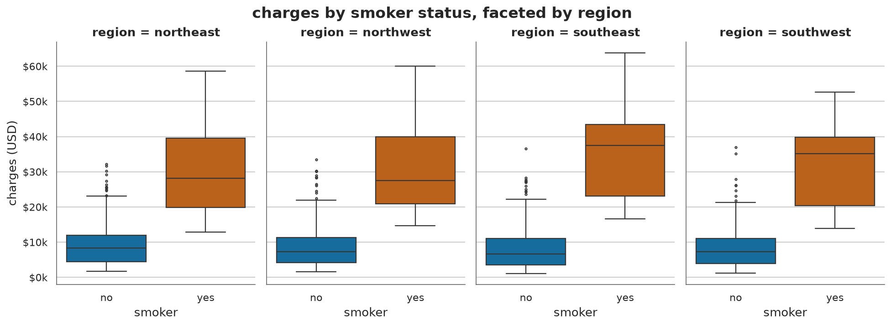

**Interpretation:** The smoker gap holds in every region with the same direction and roughly the
same magnitude, demonstrating that the effect is robust and not confounded by geography.
**Styling choice:** Faceting by `region` on a shared y-axis lets the reader compare the smoker
split across panels directly, with the fixed smoker palette repeated in each facet.

### Smoker status — box plus points with mean gap annotated

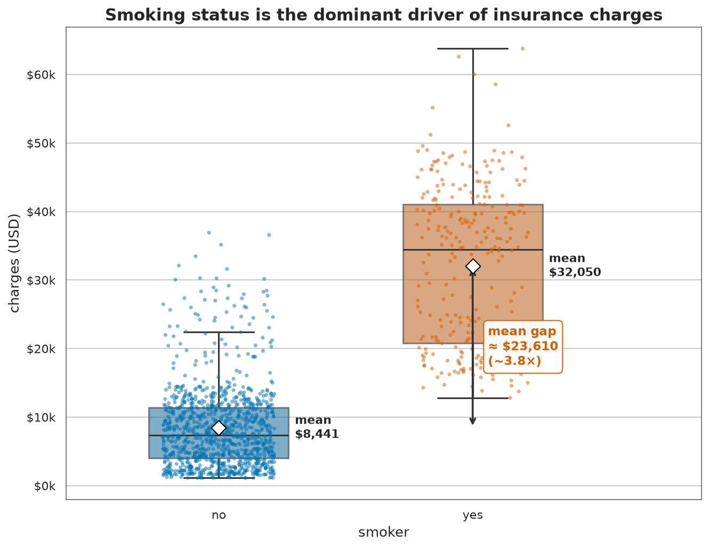

**Interpretation:** This headline figure quantifies the single strongest relationship in the
dataset — non-smokers average ≈$8,441 versus ≈$32,050 for smokers, a ~$23.6k (≈3.8×) gap that
dwarfs every other feature effect. **Styling choice:** Overlaying jittered points on a translucent
box, marking each mean with a diamond, and annotating the gap with a double-headed arrow makes the
magnitude and its supporting data unmistakable in one prominent panel.

---

## Category 3: Comparison Visualizations (Group Comparisons)

These figures compare mean and total insurance charges across groups (region, sex, age group, BMI category) with smoker status as the recurring cross-cutting factor. All monetary axes and value labels are in USD, colors are drawn from the colorblind-safe Wong palette, and smoker status uses the fixed semantic mapping (blue = non-smoker, orange = smoker) everywhere.

### Grouped bar — mean charges by region and smoker status
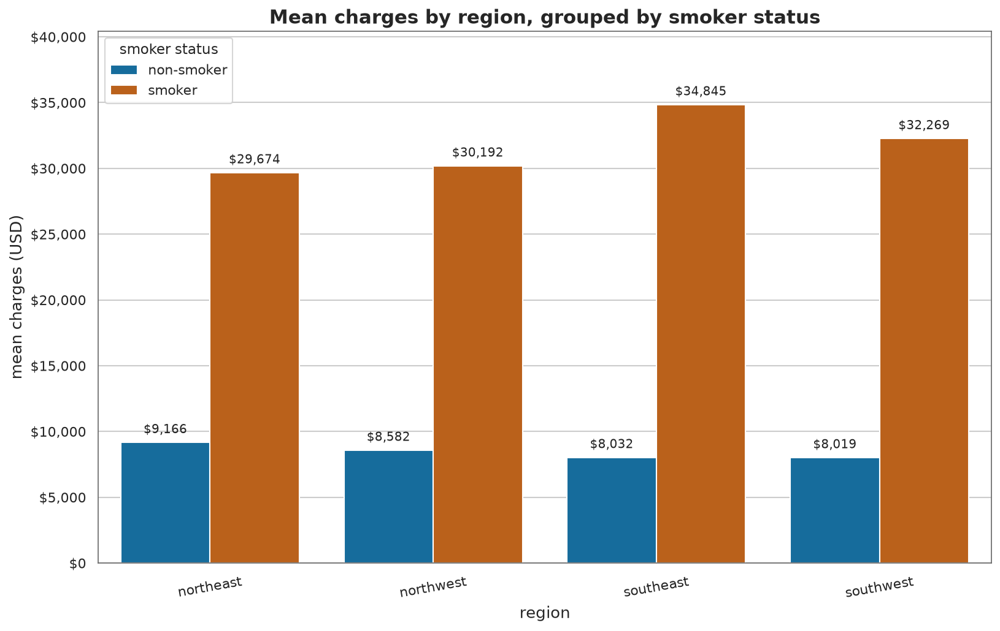

**Interpretation:** Within every region smokers pay roughly 3.5-4x what non-smokers pay, and that smoker gap dwarfs any between-region differences; the southeast edges out other regions largely because it carries the highest smoker share. Region on its own is a weak driver once smoker status is accounted for.

**Styling choice:** Grouping by the fixed smoker palette (blue/orange) keeps the dominant smoker signal visually separate from the secondary region axis.

### Grouped bar — mean charges by sex and smoker status
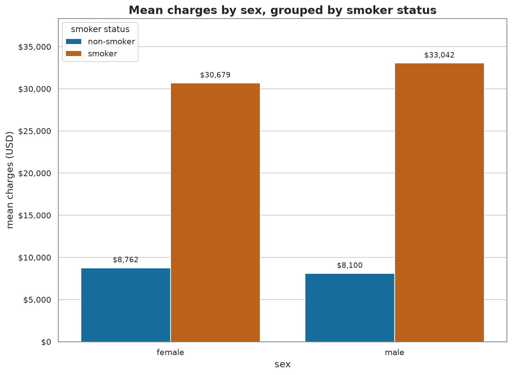

**Interpretation:** Male and female non-smokers cost almost the same on average, and the modest male premium among smokers reflects BMI/behavior differences rather than sex itself. Smoker status, not sex, is the decisive split.

**Styling choice:** Value labels sit directly above each bar so the small sex-level differences can be read precisely instead of estimated from bar height.

### Stacked bar — smoker proportion within each region
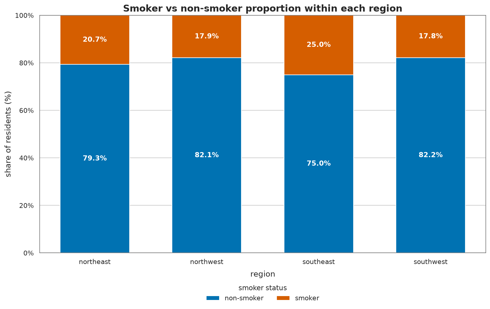

**Interpretation:** Smoker prevalence is fairly even across regions (about 18-25%), with the southeast highest at 25.0% and the southwest lowest at 17.8%. This even spread is why region correlates only weakly with charges once smoking is controlled for.

**Styling choice:** A 100%-stacked layout normalizes each region to full height so shares are directly comparable, with percentages labeled inside each segment.

### Heatmap — mean charges by age group and BMI category
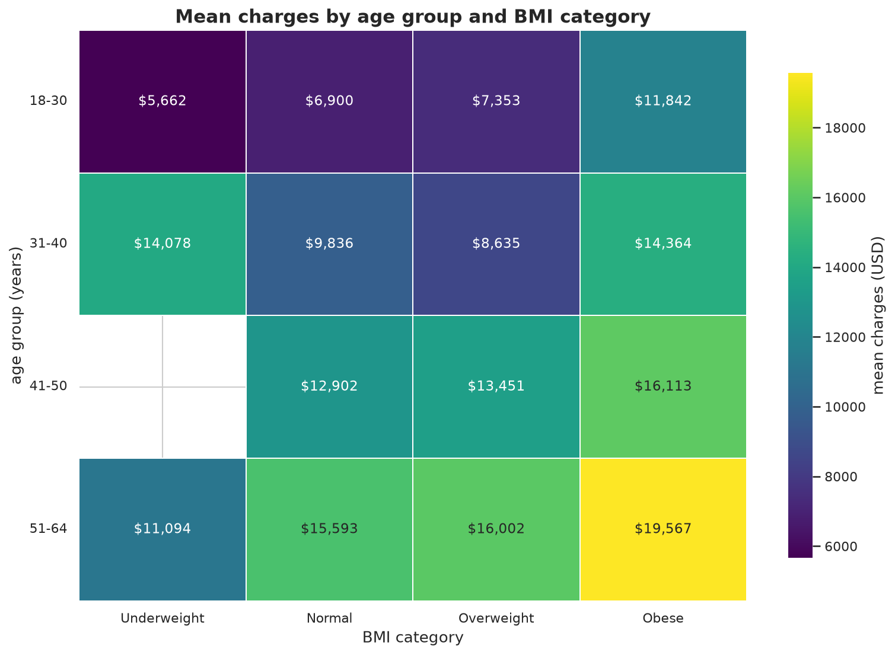

**Interpretation:** Mean charges rise moving down (older) and right (higher BMI), peaking for 51-64 Obese enrollees (~$19,567) versus the ~$5,662 minimum for the youngest, underweight group. The blank 41-50 Underweight cell simply reflects that no enrollees fall in that rare combination.

**Styling choice:** The sequential viridis colormap (perceptually uniform, colorblind-safe) encodes magnitude while $-formatted cell annotations give exact values.

### Treemap — total charges by region and smoker status
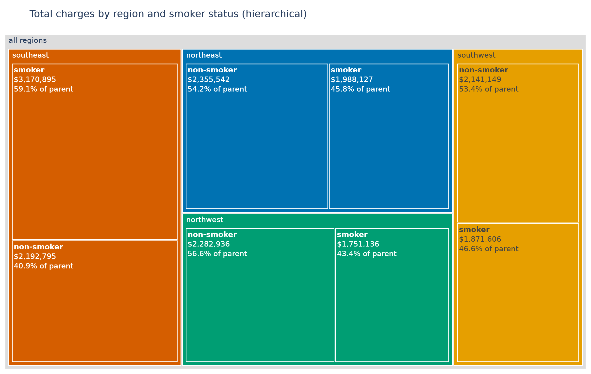

**Interpretation:** The southeast is the largest single block of total charges, and within it smokers alone account for ~59% of spend despite being a minority of members. Across every region the smoker tiles are disproportionately large relative to their headcount, visualizing how a small smoking population drives a large share of total cost.

**Styling choice:** Built with Plotly (region colored via the shared region palette) so tiles are labeled with group, dollar total, and share of parent; an interactive version is saved at `figures/cat3_treemap_region_smoker.html` alongside the static PNG.

### Boxplot — charges by age group
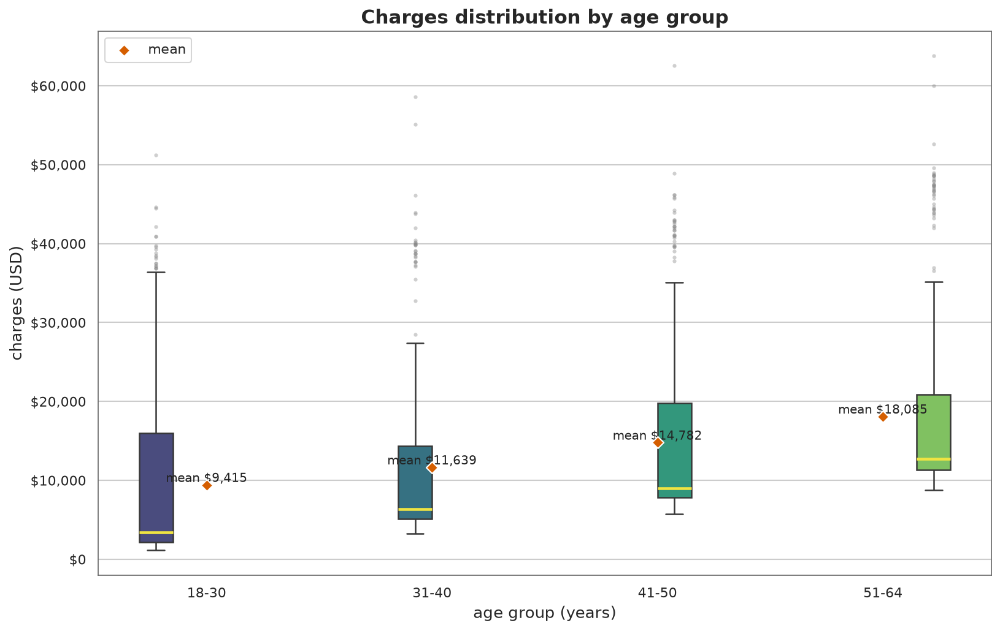

**Interpretation:** Median and mean charges climb steadily with age (mean ~$9,415 at 18-30 rising to ~$18,085 at 51-64), while a persistent cluster of high outliers in every group marks the smokers. Age shifts the whole distribution upward but the outlier smoker band is present at all ages.

**Styling choice:** A viridis-ordered box sequence plus an overlaid diamond mean marker separates the typical (median) from the outlier-inflated mean.

### Grouped bar — mean charges by age group and smoker status
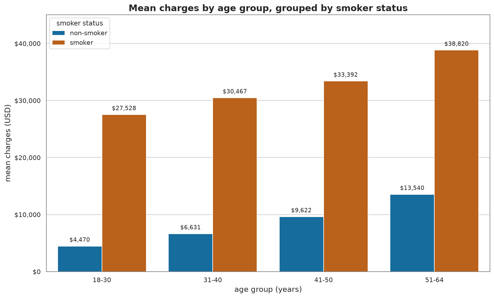

**Interpretation:** Both smokers and non-smokers get more expensive with age, but the smoker bars rise from a far higher base and the absolute smoker/non-smoker gap widens in older groups. Age amplifies, rather than replaces, the smoking effect.

**Styling choice:** Consistent blue/orange smoker hues let the reader track the widening gap across the age axis at a glance.

### Boxplot — charges by BMI category
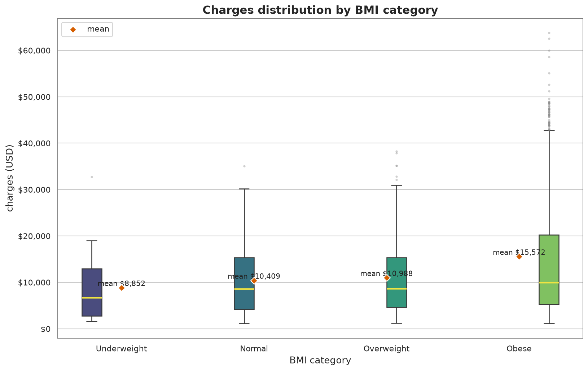

**Interpretation:** Medians barely move across BMI categories, but the Obese group shows a much longer upper tail and higher mean, signaling that high BMI raises cost only for a subset (the smokers). The mean-vs-median divergence in the Obese box previews the interaction shown next.

**Styling choice:** Ordered categories (Underweight to Obese) with a diamond mean overlay expose the mean/median split that a plain boxplot would hide.

### Grouped bar — mean charges by BMI category and smoker status (interaction)
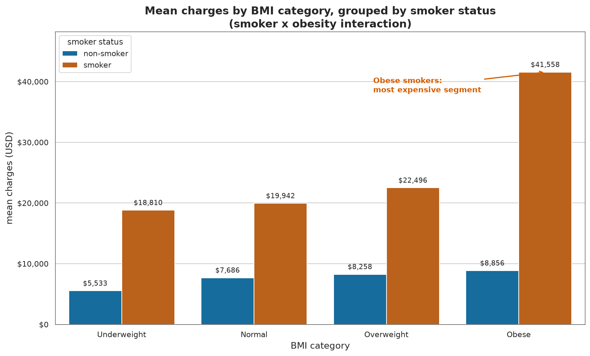

**Interpretation:** This is the key story: for non-smokers, mean charges are essentially flat across BMI (~$5.5k-$8.9k), but for smokers they jump sharply at obesity, with Obese smokers averaging ~$41,558 -- by far the most expensive segment. BMI matters almost entirely through its interaction with smoking.

**Styling choice:** The annotated arrow flags the Obese-smoker bar so the smoker x obesity interaction reads immediately, with $-formatted labels on every bar for exact comparison.

---

## Category 4: Correlation & Multivariate Visualizations

These figures move beyond one-variable-at-a-time views to expose how the
predictors relate to each other and, above all, how **smoking status
interacts** with the other features to drive insurance charges. All numeric
axes use exact schema columns (`age`, `bmi`, `children`, `charges`), smoker is
colored consistently (`no` = blue, `yes` = vermillion), and every projection
that mixes units is min-max normalized first.

### Correlation heatmap
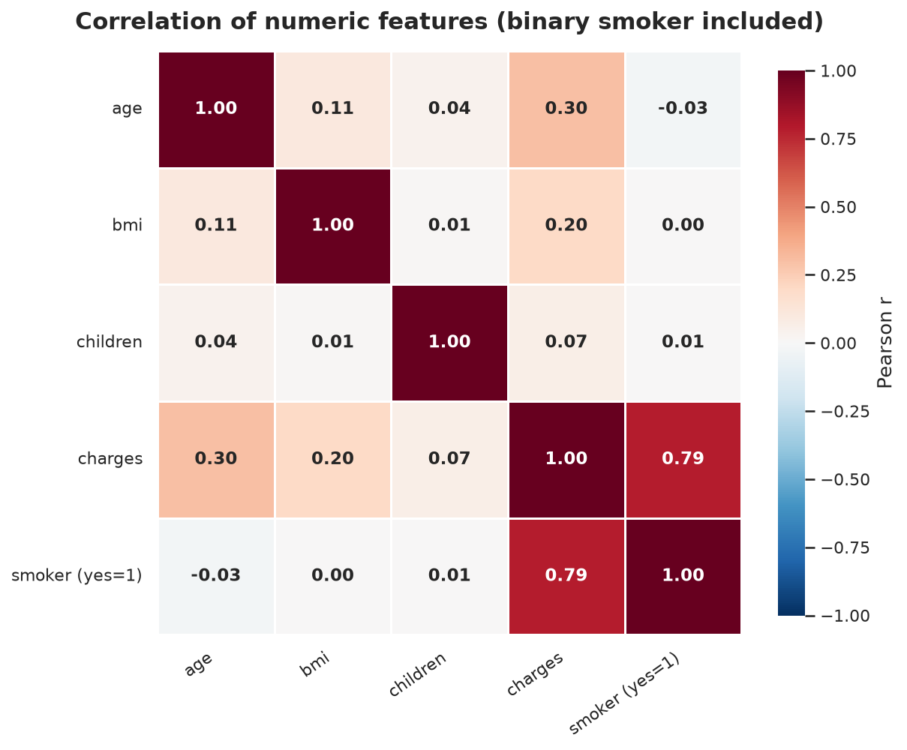

**Interpretation:** Binary-encoded smoker dominates every other signal with a
Pearson r of 0.79 against charges, dwarfing age (0.30) and bmi (0.20), while
the predictors themselves are essentially uncorrelated (all |r| <= 0.11), so
there is no meaningful collinearity to worry about. The single strong red cell
in the smoker row is the headline of the entire analysis.

**Styling choice:** The diverging `RdBu_r` colormap fixed at vmin=-1, vmax=1,
center=0 with a square grid makes the sign and magnitude of each correlation
readable at a glance, and every cell is annotated with its value.

### Pairplot colored by smoker
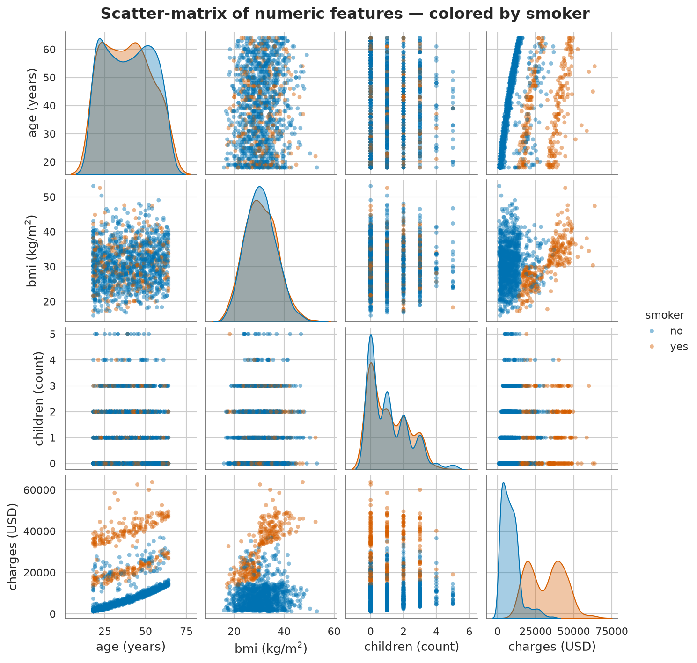

**Interpretation:** Coloring the scatter-matrix by smoker splits the
`charges` panels into two cleanly separated bands, and the bimodal charges KDE
on the diagonal shows smokers forming their own high-cost population; no such
separation appears in age, bmi, or children on their own.

**Styling choice:** KDE diagonals with transparent scatter (alpha 0.45) keep
the dense 1,300-point matrix legible while still showing where the two smoker
groups overlap versus diverge.

### Pairplot colored by region
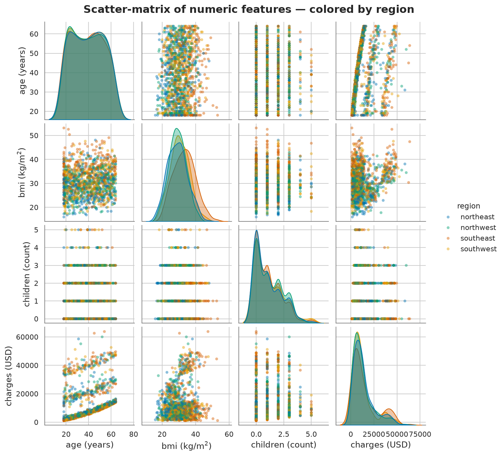

**Interpretation:** Unlike smoker, region produces heavily overlapping,
intermingled clouds in every panel, confirming that geography contributes
little structure to the numeric relationships and is a weak predictor of
charges relative to smoking.

**Styling choice:** The fixed four-color region palette (blue/green/vermillion/
orange, all colorblind-safe and never red-green paired) keeps region identity
consistent with the rest of the suite.

### Parallel coordinates
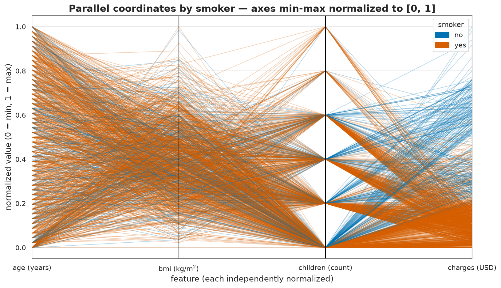

**Interpretation:** After normalizing each axis to [0, 1], the smoker (orange)
and non-smoker (blue) lines are thoroughly mixed on age, bmi, and children but
fan apart on the final `charges` axis, where orange lines ride high and blue
lines stay low, visually restating the r = 0.79 relationship.

**Styling choice:** Low alpha (0.28) on thin lines controls overplotting across
all rows, and a rebuilt legend maps colors explicitly to smoker levels.

### RadViz projection
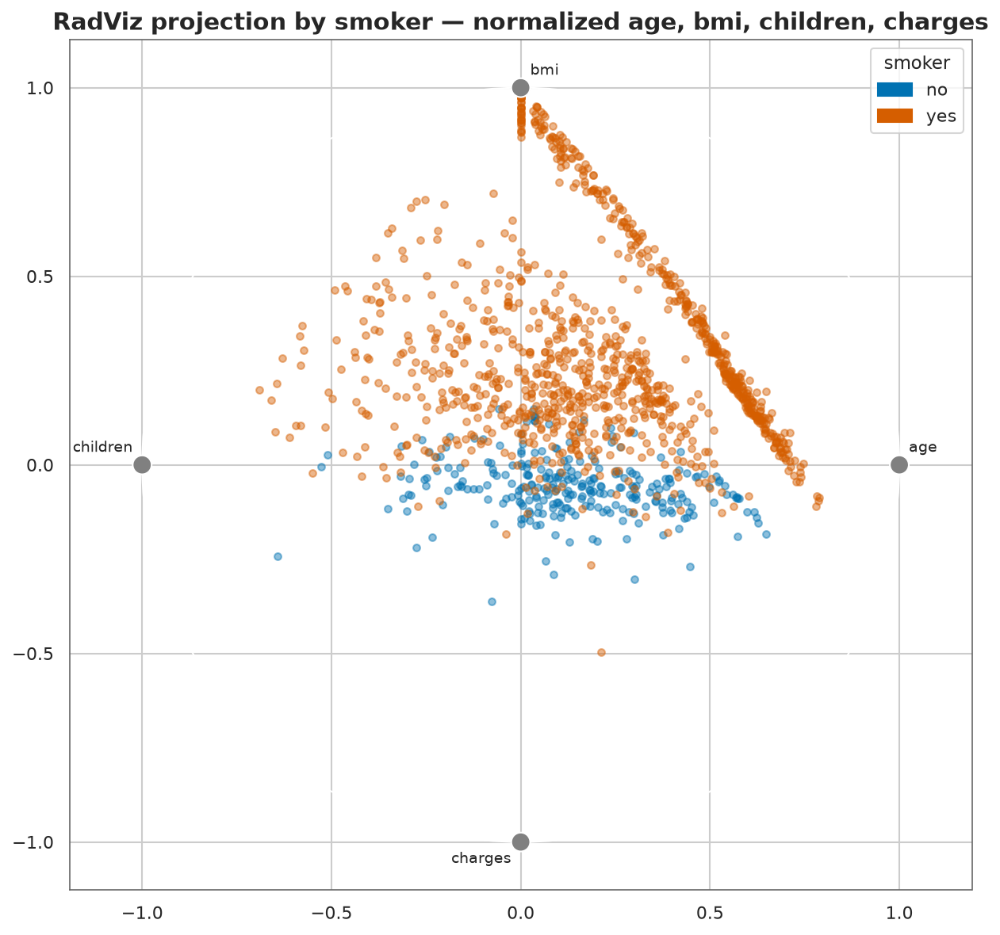

**Interpretation:** In the RadViz spring layout the two smoker classes drift
toward different regions of the circle, pulled by the `charges` anchor, giving
a compact 2-D confirmation that smoking status is the dimension that best
separates the observations.

**Styling choice:** Inputs are min-max normalized before projection (required
for RadViz to be meaningful) and drawn with alpha 0.45 so overlapping points
remain distinguishable.

### Andrews curves
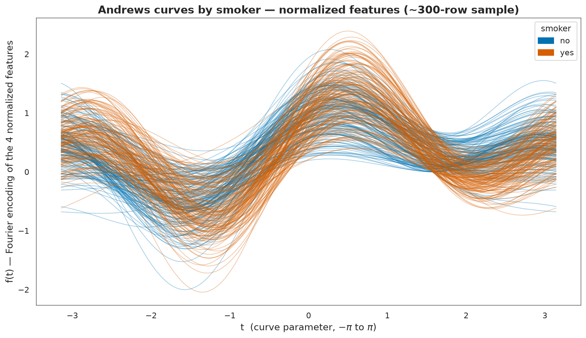

**Interpretation:** The Fourier-encoded curves for smokers and non-smokers
trace visibly different envelopes, indicating the two groups occupy different
multivariate signatures even though individual features overlap.

**Styling choice:** A balanced ~300-row sample (150 per smoker class) with
alpha 0.35 prevents the curve bundle from turning into an unreadable smear.

### Faceted regression: age vs charges by smoker
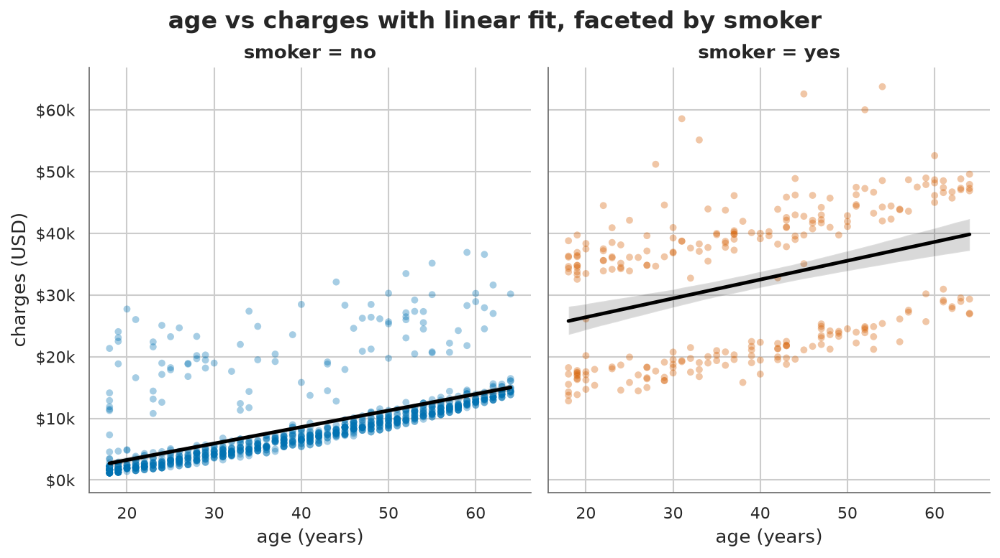

**Interpretation:** Both smokers and non-smokers show charges rising with age,
but the smoker facet sits on a much higher intercept and shows wider spread,
so age adds cost within each group while smoking sets the baseline level.

**Styling choice:** `sns.lmplot` with per-facet 95% CI bands and a neutral black
fit line keeps the regression readable against the smoker-colored points.

### Faceted regression: bmi vs charges by smoker
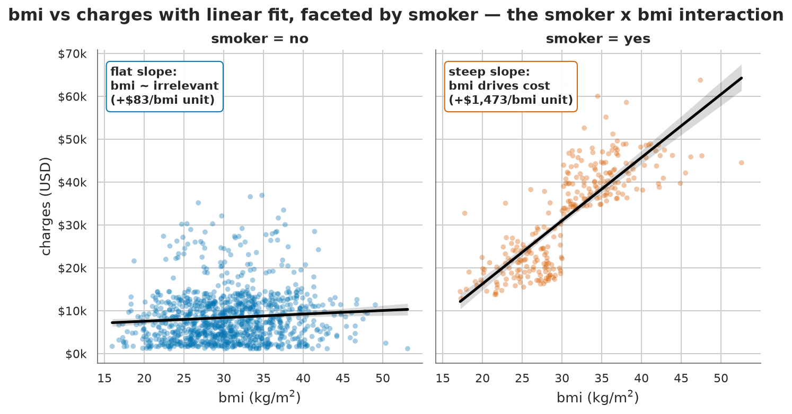

**Interpretation:** This is the central multivariate story: for non-smokers the
bmi slope is nearly flat (about +$83 per bmi unit), while for smokers it is
steep (about +$1,473 per bmi unit), a textbook smoker x bmi interaction where
obesity is costly only in combination with smoking.

**Styling choice:** Each facet carries an annotated slope callout boxed in its
smoker color so the flat-versus-steep contrast is stated numerically, not just
implied.

### Faceted regression: age vs charges by region
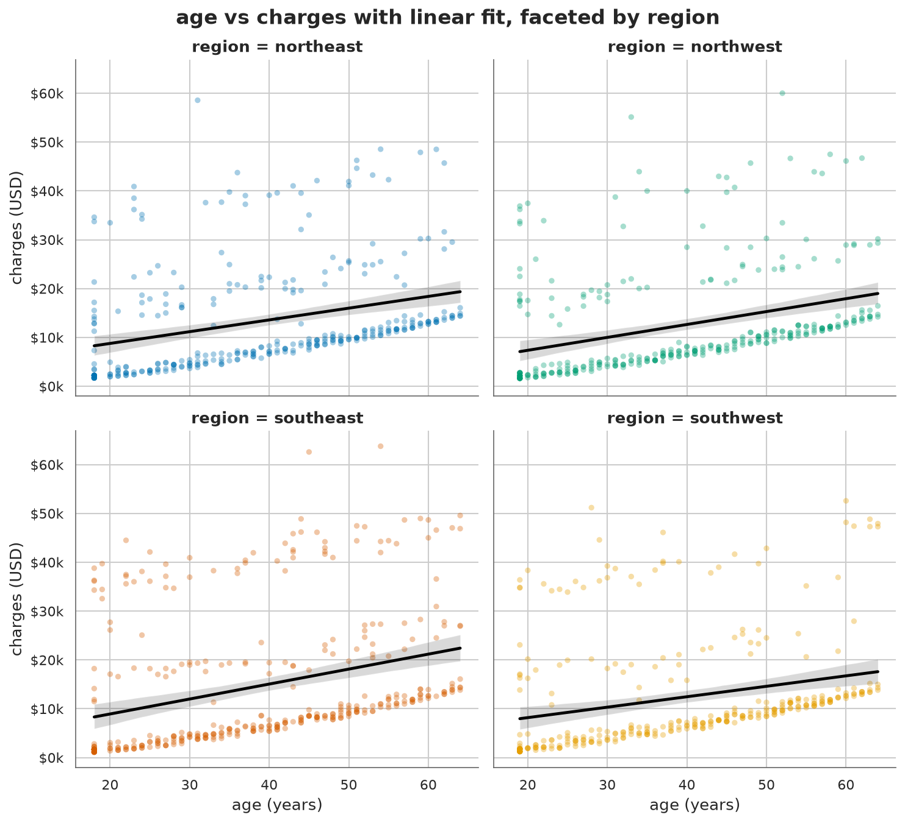

**Interpretation:** The age-charges relationship is nearly identical across all
four regions, with the same positive slope and the same smoker-driven upper
band appearing everywhere, reinforcing that region is not a meaningful
moderator.

**Styling choice:** A 2x2 `col_wrap` layout with shared axes lets the four
regional fits be compared directly at the same scale.

### Interaction plot: smoker x region
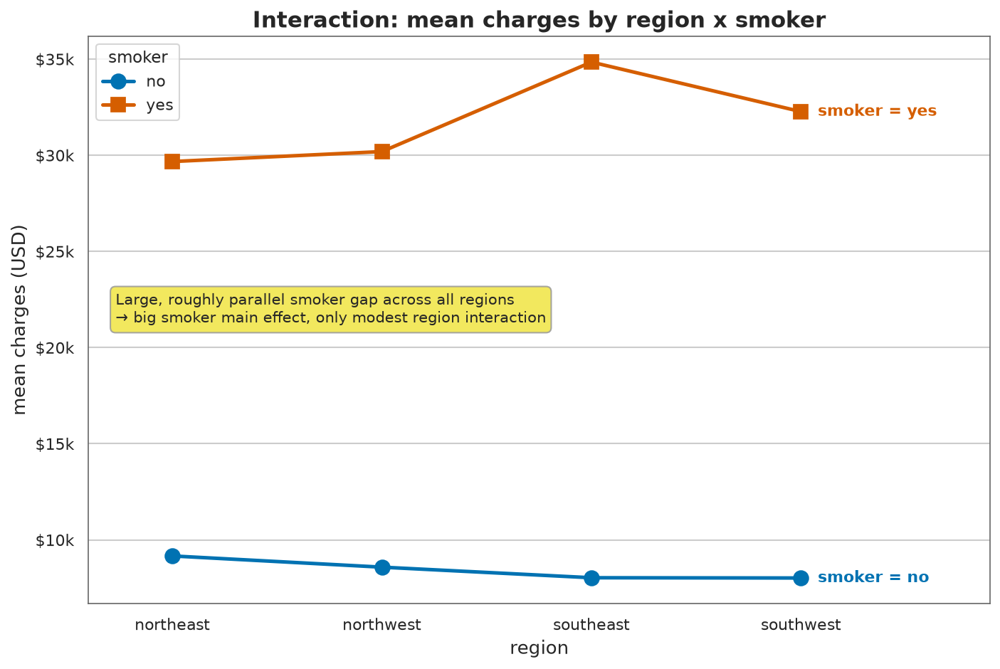

**Interpretation:** The smoker line sits far above the non-smoker line in every
region and the two lines stay roughly parallel, so there is a large smoker main
effect with only modest region-to-region variation in the penalty (a weak
interaction at most).

**Styling choice:** Direct end-of-line labels plus a highlighted takeaway box
replace a cramped legend and state the parallel-lines conclusion explicitly.

### Interaction plot: smoker x sex
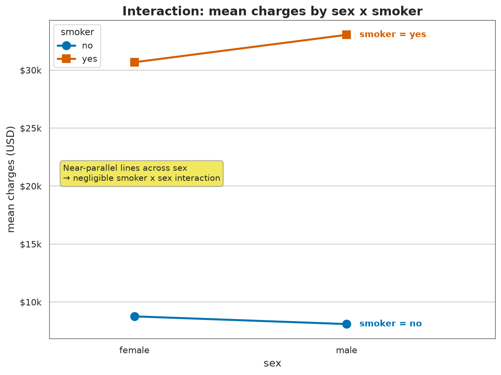

**Interpretation:** The smoker and non-smoker lines run almost perfectly
parallel across male and female, meaning the smoking penalty is essentially the
same for both sexes and there is no meaningful smoker x sex interaction.

**Styling choice:** Distinct markers (circle vs square) plus consistent smoker
colors make the two nearly-parallel lines easy to track without relying on
color alone.

---

## Category 5: Advanced & Specialized Visualizations

This category moves beyond standard 2D statistical plots into 3D structure, geographic schematics, longitudinal-style age progression, and interactive dashboards. It is designed to communicate the headline findings of the dataset — that `smoker` status dominates `charges`, that `age` and `bmi` push costs up steadily, and that `region` differences are small — to a broad audience, including interactive HTML views that let a reader explore the data themselves. Every Plotly figure is exported both as an interactive HTML file and as a static PNG preview.

### cat5_3d_scatter_smoker — 3D scatter of age x bmi x charges by smoker

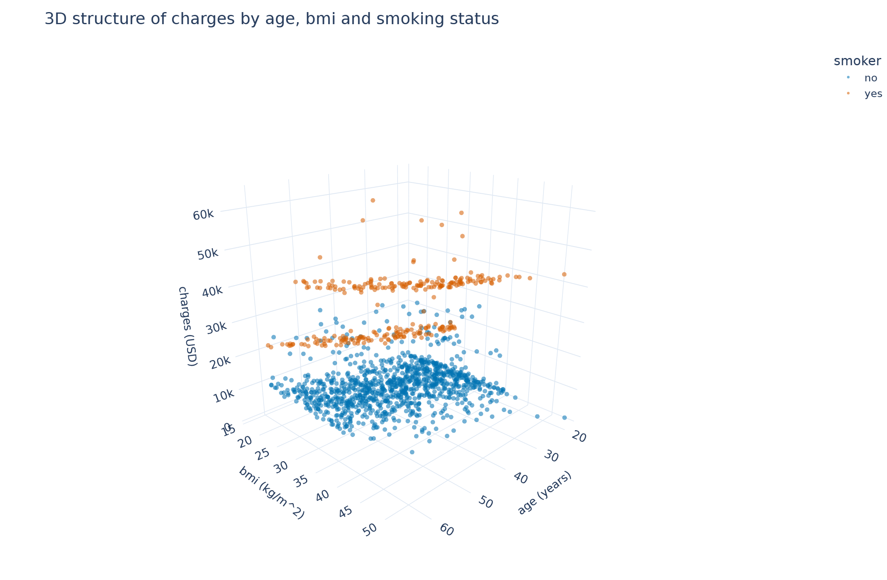

[Interactive version](figures/cat5_3d_scatter_smoker.html)

**Interpretation:** Smokers (vermillion) form a clearly elevated band of `charges` that sits far above the dense blue non-smoker cloud, and within the smoker group cost climbs further as `bmi` rises past 30 — a visibly two-tier structure that no single 2D projection captures as cleanly. This is the strongest visual statement of smoking as the dominant cost driver.

**Styling choice:** Marker opacity is set to 0.55 with small markers so the dense non-smoker cloud does not occlude the elevated smoker points, and the fixed SMOKER_PALETTE (yes=#D55E00, no=#0072B2) keeps the colorblind-safe semantics consistent with every other figure.

### cat5_3d_scatter_region — 3D scatter of age x bmi x charges by region

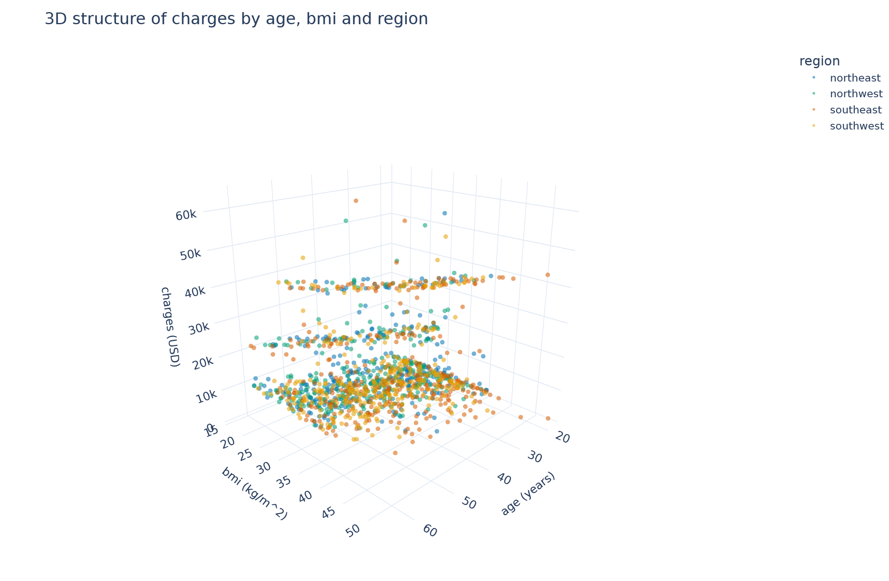

[Interactive version](figures/cat5_3d_scatter_region.html)

**Interpretation:** Coloring the same age/bmi/charges cloud by `region` shows the four regions thoroughly intermixed at every height, confirming that region carries little independent signal for charges once the dominant smoker/age/bmi structure is present. The elevated high-charge band contains all four region colors in similar proportion.

**Styling choice:** The four-way REGION_PALETTE (Wong blue/green/vermillion/orange) avoids any red-green pairing, and the same 0.55 opacity keeps the overlapping regional points legible.

### cat5_3d_surface_age_bmi — OLS-predicted charges surface

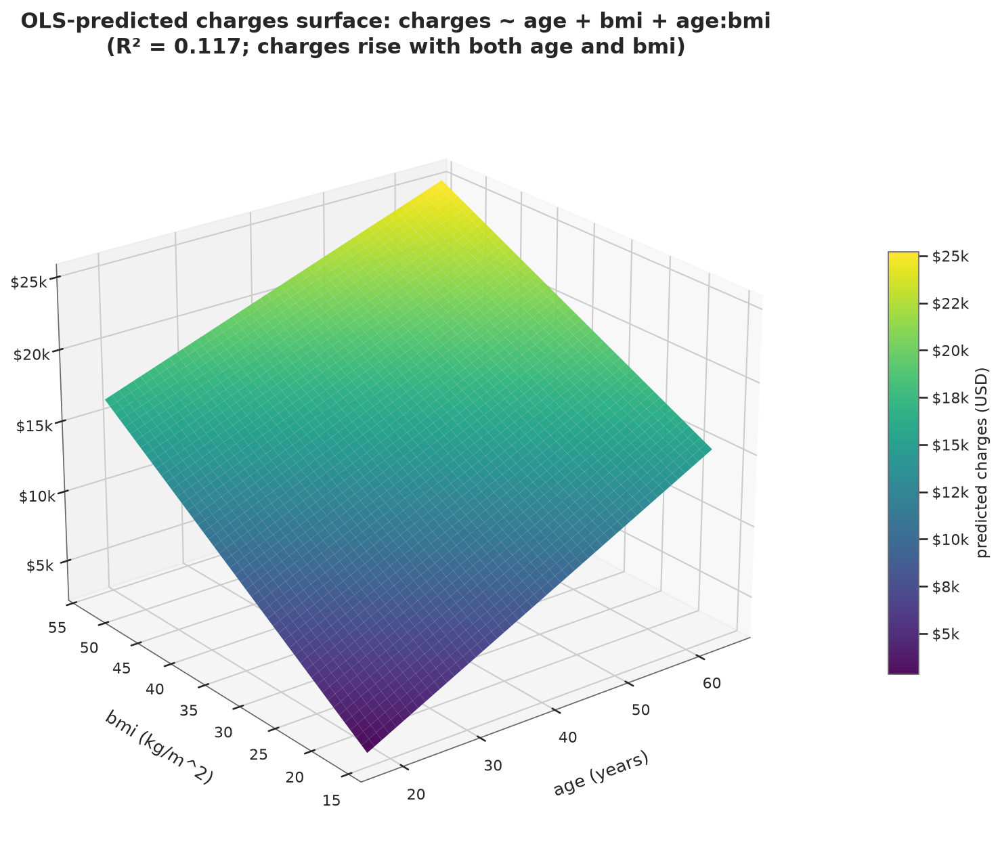

**Interpretation:** An OLS fit of `charges ~ age + bmi + age:bmi` predicts a smoothly rising surface — charges increase with both `age` and `bmi`, and the mild interaction tilts the surface so the highest predicted costs sit at the old-and-high-bmi corner. The modest R² (0.117) is expected: this pooled model deliberately excludes `smoker`, so it captures the demographic gradient but not the dominant smoking split.

**Styling choice:** Rendered with matplotlib mplot3d using the colorblind-safe viridis (SEQ_CMAP) so height and color reinforce the same quantity, with axis labels carrying explicit units and the z-axis and colorbar formatted in USD.

### cat5_region_choropleth — Schematic US-state choropleth of mean charges

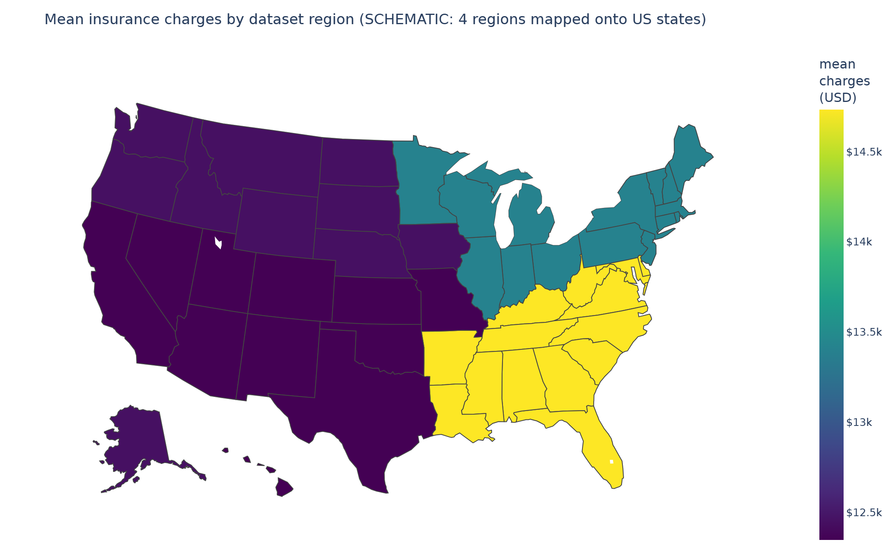

[Interactive version](figures/cat5_region_choropleth.html)

**Interpretation:** The southeast group (yellow) carries the highest mean charges (~$14,735) and the southwest the lowest (~$12,347), with northeast and northwest in between — but the total spread is under ~$2,400, reinforcing that region is a weak, statistically unreliable driver. **This map is a SCHEMATIC only:** the dataset has no finer geography than its four census-style regions, so each US state is colored by the mean charges of whichever of the four dataset regions it was assigned to, not by any real state-level data.

**Styling choice:** The sequential viridis scale encodes the single continuous quantity (mean charges) with a USD-prefixed colorbar, and the title explicitly flags the schematic nature so the map is not mistaken for real state-level measurement.

### cat5_region_bubble_map — Schematic region bubble map

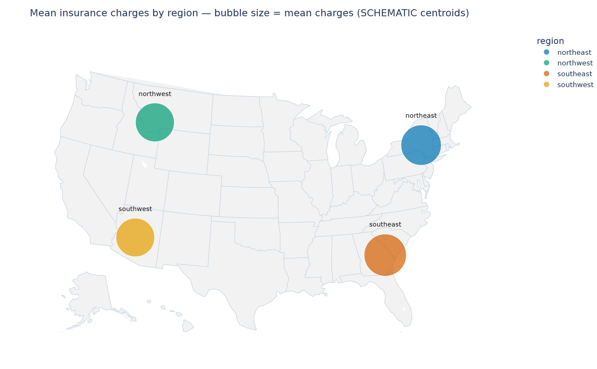

[Interactive version](figures/cat5_region_bubble_map.html)

**Interpretation:** Four bubbles placed at approximate quadrant centroids show the near-equal bubble sizes across regions, making the small magnitude of regional differences in mean charges immediately obvious. **The centroid positions are SCHEMATIC** approximations of the four dataset regions, not measured coordinates — the dataset contains no latitude/longitude information.

**Styling choice:** Bubble size encodes mean charges while the REGION_PALETTE color redundantly identifies each region, and the caption/title flag the schematic centroids so the placement is read as illustrative rather than precise.

### cat5_age_progression — Charges-vs-age progression by smoker

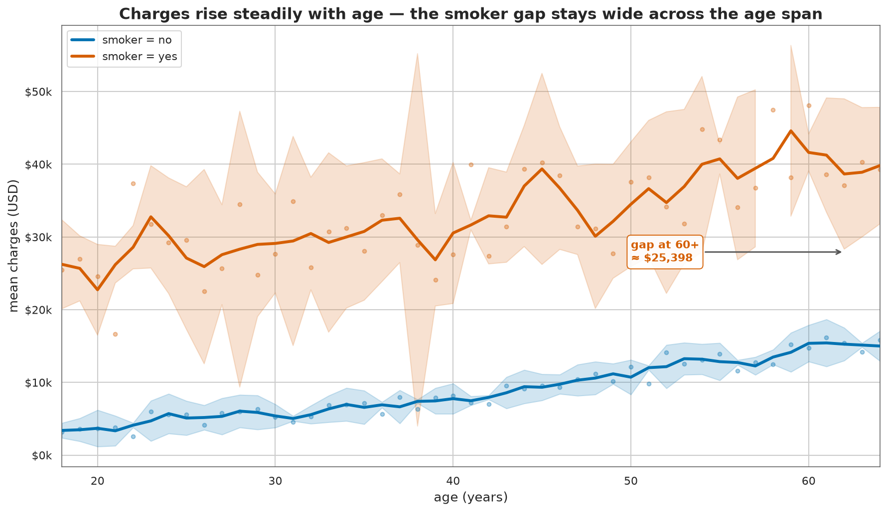

**Interpretation:** Both smoker and non-smoker mean charges rise steadily and roughly in parallel with age, but the vertical gap between the two lines stays wide across the entire 18-64 span (reaching ~$25,398 at ages 60+). Age adds cost for everyone, yet it never closes the smoking penalty.

**Styling choice:** A light 3-point rolling smooth on the per-age means plus translucent 95% CI bands tame the small-sample noise (especially in the smaller smoker group) while the SMOKER_PALETTE lines and faint raw-mean dots preserve the underlying data.

### cat5_summary_multipanel — Static key-insights dashboard

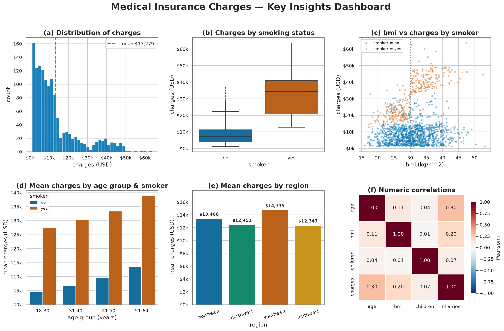

**Interpretation:** The six panels tell the whole story at a glance: charges are right-skewed (a), smokers cost far more (b), the smoker cost explosion kicks in above bmi 30 (c), cost rises with age within both smoker groups (d), regional means are nearly flat (e), and age/bmi are the strongest numeric correlates of charges among a generally weak set (f). Together they preview the same conclusions the earlier categories establish in detail.

**Styling choice:** A single 2x3 GridSpec with lettered panel titles, one bold suptitle, consistent USD-formatted axes, and the shared semantic palettes gives a cohesive one-page executive summary.

### cat5_interactive_dashboard — Interactive bmi-vs-charges explorer

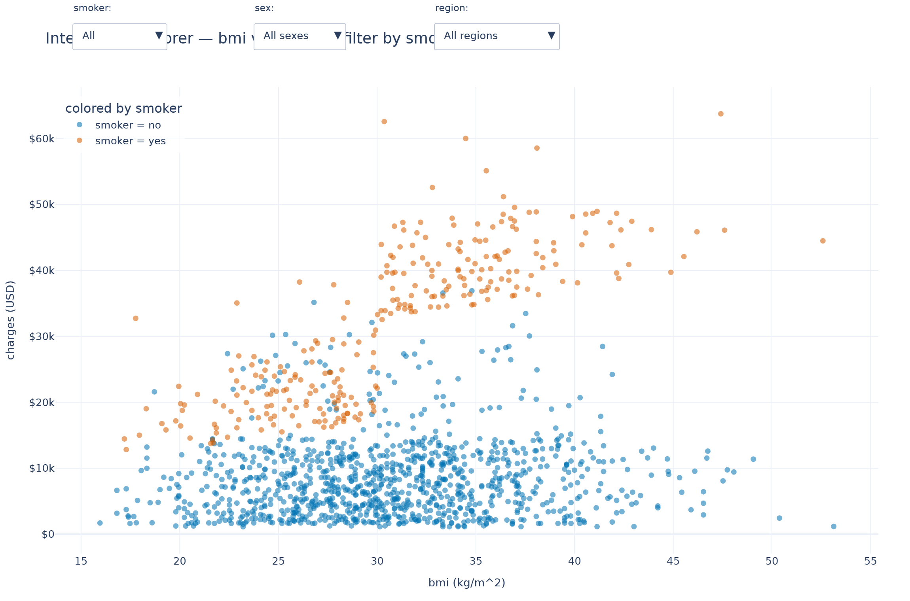

[Interactive version](figures/cat5_interactive_dashboard.html)

**Interpretation:** The default view scatters `bmi` against `charges` colored by smoker; three dropdowns let a reader filter the points by smoker, sex, or region and watch the elevated smoker band appear, disappear, or thin out — an interactive confirmation that the smoker split, not sex or region, restructures the plot. The static PNG shows the unfiltered default state.

**Styling choice:** Built with plotly graph_objects `updatemenus` restyle buttons so filtering is instant and self-contained in one HTML file, keeping the SMOKER_PALETTE colors, USD-prefixed axis, and the plotly_white template consistent with the rest of the suite.

---

## Category 6: Creative & Original Visualizations

This category moves beyond the standard bar/box/scatter vocabulary of the earlier sections to a set of five unconventional, high-impact charts. Each is chosen specifically to expose a real driver of `charges` — above all the dominant `smoker` effect and its interaction with BMI and age — in a way a conventional chart cannot.

### cat6_ridge_charges_by_bmicat_smoker — Ridge / joyplot of charges

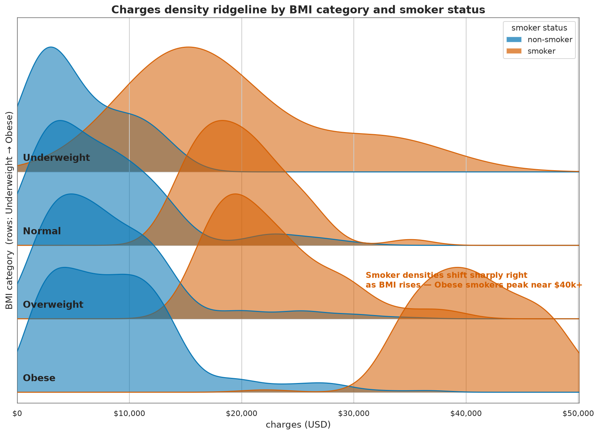

**Rationale:** A ridgeline stacks one density per BMI category so the *whole distribution* — not just a mean or median — can be compared across four groups at once, with smoker and non-smoker drawn as two overlaid densities inside each row. (Implemented manually with matplotlib and `scipy.gaussian_kde`, since `joypy` is broken under this pandas version.)

**Interpretation:** In every row the non-smoker density (blue) stays a tall, narrow spike anchored below ~$15k regardless of BMI, while the smoker density (orange) sits far to the right and slides further rightward as BMI rises — culminating in the Obese row, where smokers form a broad hump peaking near $40k+. This is the clearest single view of the smoker × obesity interaction: obesity barely moves non-smokers but massively amplifies smokers.

**Styling choice:** Rows are ordered Underweight → Obese top-to-bottom with translucent (alpha 0.55) fills so overlapping curves remain legible, and category labels sit inside each ridge to keep the left margin clean.

### cat6_waterfall_charges_decomposition — Waterfall cost-premium decomposition

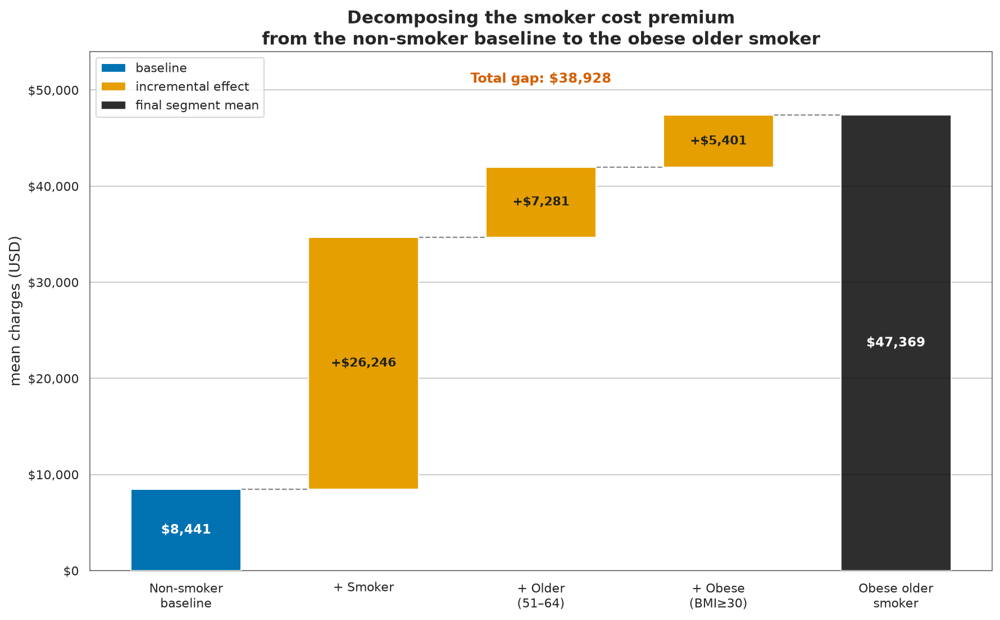

**Rationale:** A waterfall turns an abstract "the expensive segment costs a lot more" into an auditable running total, attributing the gap between the non-smoker baseline and the obese, older smoker segment across three additive increments.

**Interpretation:** Starting from the $8,441 non-smoker baseline, the smoker step alone adds ~$26k — dwarfing the older-age (~$7.3k) and obesity (~$5.4k) increments — to reach the ~$47.4k obese-older-smoker mean, a ~$38.9k total gap. Smoking is not one factor among equals; it is the overwhelming component of the premium.

**Styling choice:** A green-free encoding (blue baseline, orange increments, near-black summary bar) with dashed connectors linking each bar's top to the next, and every step labelled with its signed dollar delta.

### cat6_slope_region_smoker — Slope chart of the smoker penalty by region

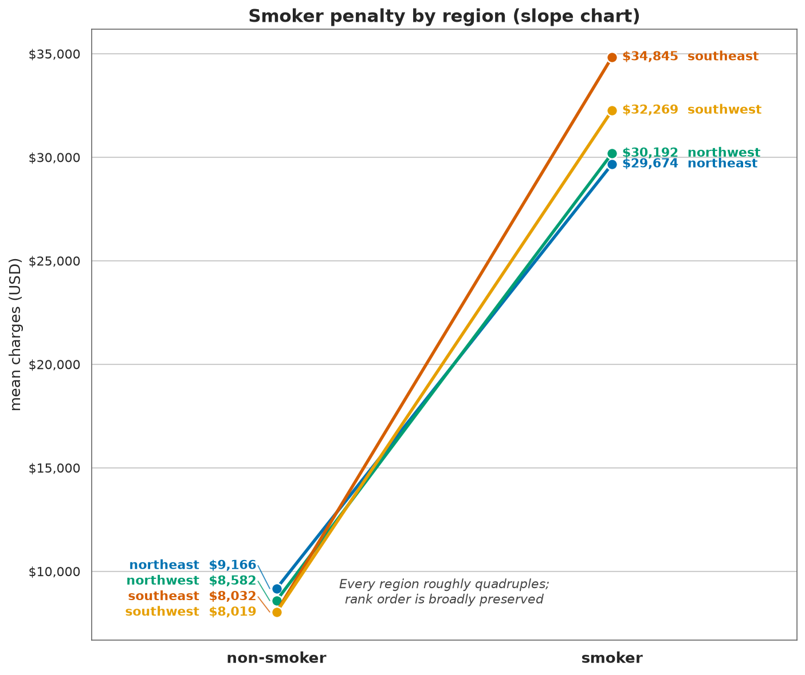

**Rationale:** A slope chart connects each region's non-smoker mean to its smoker mean with a single line, making the *magnitude and consistency* of the smoker penalty across regions readable at a glance — something grouped bars obscure.

**Interpretation:** All four lines fan steeply upward, roughly quadrupling from ~$8–9k (non-smoker) to ~$30–35k (smoker); the southeast starts lowest yet climbs highest, but the overall ordering is broadly preserved, confirming region is a weak, secondary driver next to the near-universal smoker effect.

**Styling choice:** Lines use the fixed `REGION_PALETTE`, endpoints are labelled with dollar values at both axes, and the tightly-clustered non-smoker labels are decluttered with short colored leader lines so no text overlaps.

### cat6_diverging_deviation — Diverging deviation-from-mean bars

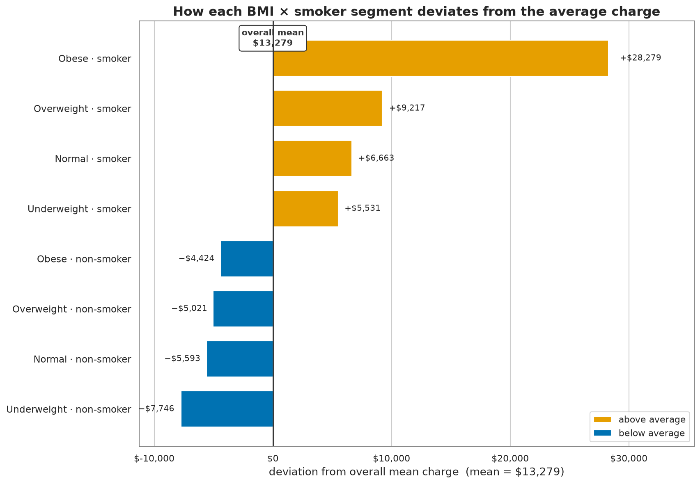

**Rationale:** Plotting each segment as a signed deviation from the overall mean (rather than an absolute level) centers the comparison on a single reference and instantly sorts winners from losers around a common baseline.

**Interpretation:** A clean split emerges — every smoker segment lands to the right (above average), every non-smoker segment to the left (below average), with the sole exception nowhere in sight: the Obese-smoker bar towers at +$28k while even the "cheapest" smoker segment beats every non-smoker segment. Smoker status, not BMI, decides which side of the mean a segment falls on.

**Styling choice:** Positive deviations are orange and negative blue (never red-green), a heavy center reference line marks the overall mean ($13,279, boxed), and bars are sorted so the gradient reads top-to-bottom.

### cat6_sankey_region_smoker_tier — Sankey flow: region → smoker → charge tier

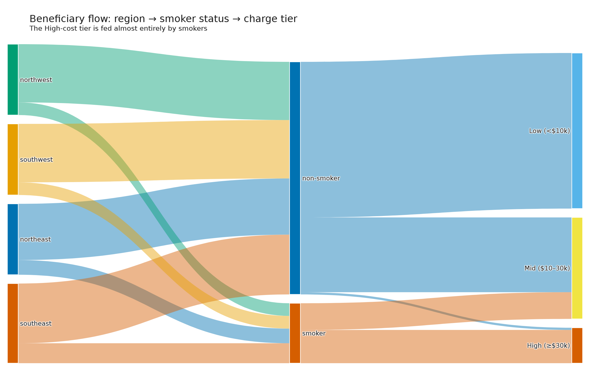

Interactive HTML: [figures/cat6_sankey_region_smoker_tier.html](figures/cat6_sankey_region_smoker_tier.html)

**Rationale:** A Sankey traces beneficiaries as flows through three stages, revealing *which upstream nodes feed which cost tier* — a routing story that bars and heatmaps cannot tell.

**Interpretation:** The non-smoker node fans out almost entirely into the Low (<$10k) and Mid ($10–30k) tiers, whereas the thin smoker node feeds nearly the entire High (≥$30k) tier; regions distribute smokers and non-smokers in similar proportions, so the High tier is fed almost exclusively by smokers regardless of region.

**Styling choice:** Colorblind-safe Wong node colors with semi-transparent links tinted by their source node, and a subtitle stating the key finding directly on the figure; exported as both interactive HTML and a static PNG via kaleido.

---

## Category 7: Visualization Summary & Executive Dashboard

### One-page executive dashboard

A single page a business leader can absorb in under a minute: four headline KPIs across the
top, then the four charts that carry the decision — (a) the raw smoker cost gap, (b) the
`smoker`×`bmi` interaction, (c) the obese-smoker segment premium, and (d) the ranked strength
of every feature. The footer states the pricing recommendation directly.
**Styling choice:** KPI "cards" use a light fill with a colored accent bar matching each
metric's semantic color, so the numbers read as a briefing, not a chart.

### Curated grid — the nine most important views

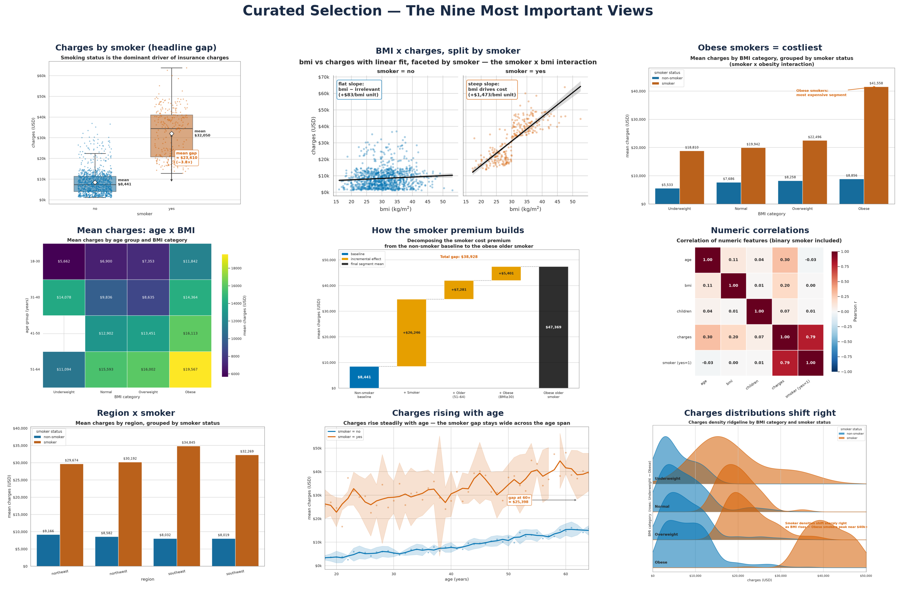

The nine highest-value figures from Categories 1–6 tiled into one board, ordered so the eye
travels from the headline gap → the interaction → the segments → the supporting structure.
**Styling choice:** re-tiling the *actual* saved figures (rather than re-plotting) guarantees
the curated board is identical to the standalone charts it references.

### The story — walking through the evidence

A logical narrative a presenter can deliver in order, building the case with the exact columns:

1. **Start with the target.** `charges` is strongly right-skewed (Category 1: histogram/KDE,
   ECDF, Q-Q) — most beneficiaries are inexpensive, but a long tail of high-cost cases pulls
   the mean above the median. This shape is the whole reason cost is interesting: *something*
   creates that tail.

2. **Name the driver.** Split `charges` by `smoker` (Category 2: `cat2_smoker_box_points`) and
   the tail resolves almost entirely into smokers — mean **$32,050 vs $8,441**, a ~3.8× gap
   with barely any distributional overlap. Of the numeric/binary features, `smoker` carries by
   far the largest correlation with `charges` (**r ≈ 0.79**; Category 4 heatmap).

3. **Explain the tail's shape.** The driver is not additive — it *interacts* with `bmi`
   (Category 4 `cat4_facet_bmi_charges_by_smoker`; Category 3 `cat3_bar_charges_by_bmicat_smoker`).
   Among non-smokers, `bmi` barely moves `charges` (~+$83 per BMI unit); among smokers the slope
   is ~**+$1,473 per BMI unit**, and **obese smokers average ~$41,558** — the single most
   expensive segment in the data.

4. **Add the steady secondary effect.** `age` raises `charges` for everyone (Category 5
   `cat5_age_progression`; r ≈ 0.30), in roughly parallel bands for smokers and non-smokers —
   so the smoker gap *stays wide across the entire age span* rather than closing.

5. **Rule out the rest.** `region`, `sex`, and `children` show weak, statistically unreliable
   relationships with `charges` (Category 3 region/sex bars; Category 4 interaction plots show
   `smoker`×`sex` lines nearly parallel = no interaction). They should not drive pricing.

6. **Quantify the buildup.** The waterfall (Category 6 `cat6_waterfall_charges_decomposition`)
   decomposes the journey from the non-smoker baseline to the obese older smoker, and the
   Sankey shows the High-cost tier is fed almost entirely by smokers — closing the case.

### Recommendations — what to put in the final report/presentation

**Tier 1 — lead with these (the decision-grade charts):**
- `cat7_executive_dashboard.png` — the single most important asset; put it on slide 1.
- `cat2_smoker_box_points.png` — the headline smoker gap, unambiguous.
- `cat3_bar_charges_by_bmicat_smoker.png` — the `smoker`×`bmi` interaction in one glance.
- `cat6_waterfall_charges_decomposition.png` — how the premium builds, for a cost narrative.

**Tier 2 — strong support:**
- `cat4_corr_heatmap.png` and `cat4_facet_bmi_charges_by_smoker.png` (quantify the interaction).
- `cat3_heatmap_age_bmi.png` (the `age`×`bmi` cost surface as a table).
- `cat5_age_progression.png` (the persistent gap across `age`).
- `cat6_ridge_charges_by_bmicat_smoker.png` (distribution shift — visually striking).

**Tier 3 — appendix / interactive exploration:**
- The Plotly interactive files: `cat5_interactive_dashboard.html` (dropdown filters),
  `cat5_3d_scatter_smoker.html`, `cat3_treemap_region_smoker.html`,
  `cat6_sankey_region_smoker_tier.html`.
- Distribution/diagnostic plots (Q-Q, ECDF, residuals) belong in a technical appendix.

**Charts to de-emphasize:** the `region` choropleth/bubble maps are honest *schematics* (the
dataset has only four census-style regions with no true coordinates) and `region` is not a
reliable driver — keep them illustrative only, clearly labeled as schematic.

### Final checklist

| # | Category | Delivered |
|---|----------|-----------|
| 1 | Distribution (univariate) | ✔ hist+KDE, box+violin, density, Q-Q, ECDF, bar, pie, waffle, charges bin-sensitivity, charges CDF (10 figures) |
| 2 | Relationship (bivariate vs target) | ✔ scatter+reg, LOESS, hexbin, 3 jointplots, residuals, box, violin, strip/swarm, bar+CI, faceted catplot, smoker box+points (13) |
| 3 | Comparison (group) | ✔ grouped region×smoker, grouped sex×smoker, stacked smoker-by-region, age×bmi heatmap, treemap (+HTML), agegroup box/bar, bmicat box/bar (9) |
| 4 | Correlation & multivariate | ✔ corr heatmap, 2 pairplots, parallel coords, RadViz, Andrews, 3 faceted scatters, 2 interaction plots (11) |
| 5 | Advanced & specialized | ✔ 2 3D scatters, 3D surface, choropleth, bubble map, age progression, multi-panel, interactive dashboard (8; 5 with HTML) |
| 6 | Creative & original | ✔ ridge/joyplot, waterfall, slope, diverging deviation, Sankey (5) |
| 7 | Summary & executive | ✔ executive dashboard, curated 3×3 grid, narrative, recommendations, this checklist |

**Totals:** 58 static figures (PNG + PDF each) and 7 interactive HTML charts, all inside the
`Medical Insurance Cost Dataset\visualizations\` folder. Styling requirements
(colorblind-safe palette, ≥14/12/10pt text, units, value labels, annotations, no red-green,
alpha on dense plots) applied throughout.

**Ready for modeling?** Yes — the visual case is complete and consistent with the Stage-2 EDA.
Recommended next step: a tree-based model or a GLM with explicit `smoker`×`bmi` and
`smoker`×`age` interaction terms, fit on a log-transformed `charges` target.
